第六章 多元函数微分学

# 第六章 多元函数微分学

## 第一节 多元函数的概念、极限与连续

［课前导读］

上册我们学习了一元函数微积分，所讨论的均是单变量函数，但在现实生活中，这样的情形是少数，而大量的情况往往是多变量的变化，即一个变量需要依赖于多个因素（多个变量），这种情况反映到数学上即为多元函数问题．由此而来的是多元函数的微分和积分问题．例如在一元函数中，如果，当且仅当，即当*x*→*x*0时*f*（*x*）的极限存在，只需要左极限和右极限同时存在且相等即可．但对于多元函数来说，极限存在的要求更复杂．本节将在一元函数的基础上，讨论多元函数的极限与连续，我们将以二元函数为主要讨论对象．首先我们把直线上的邻域和区间的概念推广到平面区域上去，然后再探讨平面区域上的二元函数的极限和连续的概念.

### 一、平面上的集合

**R**2=**R×R**={（*x，y*）\|*x，y*∈**R**}表示*xOy*坐标平面，设*M*1（*x*1，*y*1）与*M*2（*x*2，*y*2）为*xOy*平面上的两点，则表示*M*1（*x*1，*y*1）与*M*2（*x*2，*y*2）的距离.

坐标平面上具有某种性质的点的集合，称为**平面点集**，记作

*E*={（*x，y*）\|（*x，y*）具有某种性质}.

**1. 邻域的概念**

设*P*0（*x*0，*y*0）是*xOy*面上的一点，*δ*是一个正数，*xOy*面上所有与点*P*0的距离小于*δ*的点的集合，称为点*P*0的**δ邻域**，即

*U*（*P*0，*δ*）={*P*\|\|*P*0*P*\|\<*δ*}，

或

这是一个以*P*0为圆心、*δ*为半径的圆的内部（见图6-1），所以*P*0又称为邻域的**中心**，*δ*叫作邻域的**半径**；同样可以定义平面上的**去心邻域**，即

图6-1

在讨论问题时，如果不强调邻域的半径，点*P*0的邻域可以简记为*U*（*P*0）.

**2. 区域的概念**

设*D*是平面上的点集，如果*D*中的点满足下面两个条件，则称*D*为**开区域**.

（1）对于*D*中的任意一点*P*，都能找到它的一个邻域（见图6-2），使得邻域能够包含在点集*D*中（这样的点*P*称为点集的内点）.

图6-2

（2）对于*D*中的任意两点，都能用包含在*D*中的折线连接起来，即折线上的点都在*D*中（见图6-3）.

开区域简称**区域**.

图6-3

设*D*是平面区域，*P*是平面上的任意一点．若*P*的任何一个邻域中，既含有*D*中的点，也含有不是*D*中的点，那么*P*称为*D*的**边界点**（见图6-4），所有边界点的集合称为*D*的**边界**．开区域和它的边界一起构成的集合，称为**闭区域**.

图6-4

开区域（或闭区域）分为**有界区域**和**无界区域**．一个区域*D*如果能够包含在一个以原点为中心的圆内，则称为有界区域，否则就是无界区域.

如图6-5所示，平面点集*D*={（*x，y*）\|1≤*x*2+*y*2≤4}是一个有界的闭区域，边界是两个圆所对应的曲线：{（*x，y*）\|*x*2+*y*2=1}∪{（*x，y*）\|*x*2+*y*2=4}，边界曲线属于闭区域*D*.

图6-5

图6-6所表示的平面点集*D*={（*x，y*）\|*x+y*\>0}是无界（开）区域．边界是直线*y*=－*x*，边界不属于区域*D*.

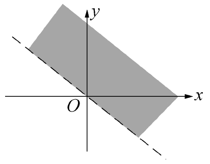

图6-6

### 二、二元函数的概念

和一元函数一样，二元函数也是从实际问题中抽象出来的一个数学概念．例如，圆柱体的体积*V*和它的高*h*及底面半径*r*之间有如下的关系：

*V*=π*r*2*h*，

当*r、h*在集合{（*r，h*）\|*r*\>0，*h*\>0}内取值时，则有唯一的*V*=π*r*2*h*与之对应.

又例如，一定量的理想气体的压强*P*、体积*V*和温度*T*之间有如下的关系：

其中*R*是常数．当*T、V*在集合{（*T，V*）\|*T*\>*T*0，*V*\>0}内取值时，有唯一的与之对应.

上面的两个实际问题说明，在一定的条件下，当两个变量在允许的范围内取值时，另一个变量通过对应的法则有唯一的值与之对应．由此我们得到了以下的二元函数的定义.

**定义1** 设*D*是平面上的一个非空点集，如果对于*D*内的任一点（*x，y*），按照某种法则*f*，都有唯一确定的实数*z*与之对应，则称*f*是*D*上的**二元函数**，它在（*x，y*）处的函数值记为*f*（*x，y*），即*z*=*f*（*x，y*），其中*x*、*y*称为**自变量**，*z*称为**因变量**．点集*D*称为该函数的**定义域**，数集{*z*\|*z*=*f*（*x，y*），（*x，y*）∈*D*}称为该函数的**值域**.

按照定义，在关系式*V*=π*r*2*h*中，*V*是*h、r*的二元函数，集合{（*r，h*）\|*r*\>0，*h*\>0}称为该二元函数的定义域；在关系式中，*P*是*T、V*的二元函数，集合{（*T，V*）\|*T*\>*T*0，*V*\>0}称为该二元函数的定义域.

与一元函数一样，二元函数的定义域也可作以下约定：在一般讨论用算式表达的二元函数时，其定义域就是使这个算式有意义的自变量的变化范围．如二元函数*z*=*f*（*x，y*），其定义域就是使*f*（*x，y*）有确定值*z*的自变量*x*、*y*的变化范围所确定的点集.

比如，函数*z*=ln（*x+y*）的定义域是满足不等式*x+y*\>0的点的全体，它是一个点集：*D*={（*x，y*）\|*x+y*\>0}.

函数*z*=arcsin（*x*2+*y*2）的定义域为*D*={（*x，y*）\|*x*2+*y*2≤1}.

**例1** 求二元函数*f*（*x，y*）=的定义域.

**解** 根据二次根式的定义，*x*、*y*必须满足不等式3－*x*2－*y*2≥0，即

*x*2+*y*2≤3.

所求的函数*f*（*x，y*）=的定义域为平面点集：

*D*={（*x，y*）\|*x*2+*y*2≤3}.

这是平面上圆心在原点、半径为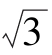的圆.

**例2** 求函数*z*=ln（*x*2+*y*2－2*x*）+ln（4－*x*2－*y*2）的定义域.

**解** 由对数的定义域可知，*x*、*y*必须同时满足解这个方程组，即得2*x*\<*x*2+*y*2\<4，从而函数的定义域为

*D*={（*x，y*）\|2*x*\<*x*2+*y*2\<4}.

**例3** 已知函数*f*（*x+y，x－y*）=，求*f*（*x，y*）的表达式，并求*f*（2，1）的值.

**解** 设*u=x+y*，*v=x－y*，则

故得

即有

从而

设函数*z*=*f*（*x，y*）的定义域为*D*，对于任意取定的点*P*（*x，y*）∈*D*，对应的函数值为*z*=*f*（*x，y*），这样，以*x*为横坐标、*y*为纵坐标、*z*为竖坐标在空间就确定一点*M*（*x，y，z*），当*x*取遍*D*上一切点时，得到一个空间点集{（*x，y，z*）\|*z*=*f*（*x，y*），（*x，y*）∈*D*}，这个点集称为**二元函数的图形**.

二元函数的图形是一张曲面，例如*z*=3*x*2+4*y*2就是一个椭圆抛物面，*z*=*x*2+*y*2的图形为旋转抛物面，的图形为上半球面等.

类似地，可定义三元及三元以上函数．当*n*≥2时，*n*元函数统称为**多元函数**.

### 三、二元函数的极限

我们先回顾一下一元函数极限的定义.

设函数*f*（*x*）在点*a*的某一个去心邻域内（即点*a*可以除外）有定义，若∀*ε*\>0，∃*δ*\>0，当0\<\|*x－a*\|\<*δ*时，恒有\|*f*（*x*）－*A*\|\<*ε*，则.

这里*a*是数轴上的定点，*x*是数轴上的动点，\|*x－a*\|表示点*x*与*a*的距离，而0\<\|*x－a*\|\<*δ*表示{*x*\|*x*∈（*a－δ，a*）∪（*a，a+δ*）}.

类似地，可建立二元函数的极限.

**定义2** 设函数*z*=*f*（*x，y*）的定义域为*D*，*P*0（*x*0，*y*0）是*xOy*平面内的定点（见图6-7）．若存在常数*A*，∀*ε*\>0，∃*δ*\>0，当点*P*（*x，y*）∈*D*∩（*P*0，*δ*）时，恒有

\|*f*（*P*）－*A*\|=\|*f*（*x，y*）－*A*\|\<*ε*，

图6-7

则称常数*A*为二元函数*f*（*x，y*）当（*x，y*）→（*x*0，*y*0）时的**极限**，记作

或

*f*（*x，y*）→*A*，（*x，y*）→（*x*0，*y*0）.

也可记作

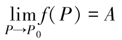=*A*或*f*（*P*）→*A*，*P*→*P*0.

**例4** 证明．

**证** ∀*ε*\>0，要使

取*δ=ε*，当时，恒有\|*f*（*x，y*）－*A*\|\<*ε*，故.

**注** 只有当*P*（*x，y*）以任何的方式趋于点*P*0（*x*0，*y*0）时，对应的函数值*z*=*f*（*x，y*）趋近于确定的常数*A*，才能说*f*（*x，y*）有极限，或者说极限的存在与自变量趋近的路径无关．反之，如果点*P*（*x，y*）沿着两条不同的路径趋于*P*0（*x*0，*y*0）时，函数值趋于不同的常数，那么函数的极限肯定不存在.

二重极限存在与不存在的举例

**例5** 证明不存在.

**证** 取*y*=*kx*（*k*为常数），则

易见函数极限的值随*k*的变化而变化．当*k*=0时，极限值为0；当*k*=1时极限值为，故极限不存在.

二元函数的极限与一元函数的极限具有类似的性质和运算法则，在此不再详述．为了区别于一元函数的极限，我们称二元函数的极限为**二重极限**.

**例6** 求极限

**解** 令*u*=*x*2+*y*2，当*x*→0，*y*→0时，*u*→0，则二元函数的二重极限就转化为一元函数的极限问题.

这里利用了一元函数极限中，无穷小和有界量的乘积是无穷小的性质.

**例7** 求极限.

**解**

这里利用了一元函数极限中，等价无穷小替换的性质.

### 四、二元函数的连续性

**定义3** 设二元函数*z*=*f*（*x，y*）在点（*x*0，*y*0）的某一邻域内有定义，（*x，y*）是邻域内任意一点，如果

则称*z*=*f*（*x，y*）在点（*x*0，*y*0）处**连续**．若不然，就称函数*z*=*f*（*x，y*）在点（*x*0，*y*0）处不连续，此时（*x*0，*y*0）称为函数*z*=*f*（*x，y*）的**间断点**.

设函数*f*（*x，y*）在*D*上有定义，且在*D*上每一点*f*（*x，y*）都连续，那么就称函数*f*（*x，y*）在*D*上连续，或者称*f*（*x，y*）是*D*上的**连续函数**.

一元函数中关于极限的运算法则，对于多元函数仍然适用．根据一元函数极限的运算法则，则有以下结论.

（1）多元连续函数的和、差、积仍为连续函数.

（2）多元连续函数的商在分母不为零时仍为连续函数.

（3）多元连续函数的复合函数仍为连续函数.

由常数及具有不同自变量的一元基本初等函数经过有限次的四则运算和复合步骤而得到的可用一个式子表示的函数称为**多元初等函数**.

一切多元初等函数在其定义区域内是连续的．所谓定义区域是指包含在定义域内的区域或闭区域.

一般地，求时，如果*f*（*P*）是初等函数，且*P*0是*f*（*P*）的定义域的内点，则*f*（*P*）在*P*0处连续，于是

**例8** 求.

**解** 因初等函数*f*（*x，y*）=在（0，1）处连续，故

**例9** 求.

**解** .

**例10** 求.

**解** 当*x*→0，*y*→0时，*x*2+*y*2→0，故

另外，对于函数

由例5可知，当*x*→0，*y*→0时，*f*（*x，y*）的极限不存在，故（0，0）是*f*（*x，y*）的间断点.

又如*f*（*x，y*）=是初等函数，它在直线*y*=－*x*上是没有定义的，所以函数*f*（*x，y*）的间断点是平面上的点集{（*x，y*）\|*x+y*=0}.

与一元连续函数的性质相类似，在有界闭区域上连续的多元函数具有如下性质.

**性质1（有界性与最大值最小值定理）** 若函数*f*（*P*）在有界闭区域*D*上连续，则*f*（*P*）在*D*上必有界，且能取得最大值和最小值.

**性质2（介值定理）** 若函数*f*（*P*）在有界闭区域*D*上连续，则*f*（*P*）必在*D*上取得介于最大值和最小值之间的任何值.

### 习题6-1

1\. 填空题.

（1）设二元函数*z*=\|*xy*\|+，则=______.

（2）设二元函数*f*（*x，y*）=，则=______；*f*（*x+y*，1）=______.

（3）设二元函数*f*（*x，y*）=*x*2+*y*2，则*f*（，*x+y*）=______.

（4）设*f*（*x+y，x－y*）=*x*2－y2，则*f*（*x，y*）=______.

（5）设=______.

（6）二元函数的定义域是______.

2\. 求下列函数的定义域.

（1）*z*=ln（*xy*）；

（2）*z*=arcsin（*x+y*）；

（3）*z*=arcsin（1－*y*）+ln（*x－y*）；

（4）；

（5）；

（6）；

（7）；

（8）.

3\. 求下列函数的极限.

（1）；

（2）；

（3）；

（4）；

（5）；

（6）.

4\. 证明下列极限不存在.

（1）；

（2）.

5\. 讨论下列函数在点（0，0）处的连续性.

（1）

（2）

6\. 判定下列函数在何处间断.

（1）；

（2）；

（3）；

（4）.

## 第二节 多元函数的偏导数与全微分

［课前导读］

在一元函数*y*=*f*（*x*）中，如果自变量*x*产生变化（由*x*0变为*x*0+Δ*x*），那么函数也会相应地产生一个增量Δ*y*=*f*（*x*0+Δ*x*）－*f*（*x*0）．而函数关于自变量的变化率，即称为函数*y*对自变量*x*的导数．在二元函数*f*（*x，y*）中，当一个自变量在变化（例如自变量*x*由*x*0变为*x*0+Δ*x*），而另一个自变量不变化（自变量*y*保持定值*y*0），则函数关于这个自变量的变化率叫作这个二元函数对这个自变量的偏导数.

对于一元函数来说，若Δ*y*=*A*Δ*x+o*（Δ*x*），*A*为常数，则称*f*（*x*）在*x*处可微，其中*A*Δ*x*称为微分，记作*dy*=*A*Δ*x．f*（*x*）在*x*处可微的充要条件是*f*（*x*）在该点可导，且

*dy*=*f′*（*x*）Δ*x*=*f′*（*x*）*dx*，

那么对于二元函数来说，如何推广微分定义，对应的微分和导数是否能延续这样的关系，这都是这一节我们要解决的问题.

### 一、偏导数

一元函数从变化率的研究引入了导数的概念：

它的几何意义是曲线*y*=*f*（*x*）在点（*x*0，*f*（*x*0））处切线的斜率为*k*=tan*α*=*f′*（*x*0）.

多元函数的自变量不止一个，因变量与自变量的关系要比一元函数复杂得多，因此我们首先考虑多元函数中关于其中一个变量的变化率．以二元函数*z*=*f*（*x，y*）为例，若只有自变量*x*变化，而自变量*y*不变（暂作常量），这时就可看作为*x*的一元函数了．比如，理想气态方程，其中*T*、*V*是两个变量，*k*是常量（比例系数）．有时需考虑在等温条件下（*T*不变）压缩气体压强*P*关于体积*V*的变化率，或在等容条件下（*V*不变）压缩气体压强*P*关于温度*T*的变化率，这些都是偏导数问题.

**1. 偏导数的定义及其计算**

**定义1** 设函数*z=f*（*x，y*）在点（*x*0，*y*0）的某一邻域内有定义，当*y*固定在*y*0，而*x*在*x*0处有增量Δ*x*时，相应的函数有增量

*f*（*x*0+Δ*x，y*0）－*f*（*x*0，*y*0）.

如果存在，则称此极限为函数*z*=*f*（*x，y*）在点（*x*0，*y*0）处**对x的偏导数**，记为

例如，

类似地，函数*z*=*f*（*x，y*）在点（*x*0，*y*0）处**对y的偏导数**为

记为

二元函数偏导数的定义可以类推到三元及三元以上的函数.

如果函数*z*=*f*（*x，y*）在区域*D*内每一点处对*x*的偏导数都存在，那么这个偏导数是*x*、*y*的二元函数，那么称为函数*z*=*f*（*x，y*）对**自变量x的偏导函数**，简称为**偏导数**，记作

同样，函数*z*=*f*（*x，y*）对**自变量y的偏导数**记作

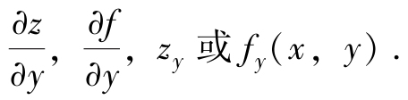

上述定义表明，在求多元函数对某个自变量的偏导数时，只需把其余自变量看作常量，然后直接利用一元函数的求导公式及复合函数求导法则来计算.

**例1** 设函数*z*=*x*3+2*x*2*y*3+*ye*x，求.

**解** 把*y*看作常量，函数*z*对自变量*x*求导得到

把*x*看作常量，函数*z*对自变量*y*求导得到

**例2** 求*z*=*f*（*x，y*）=*x*2+3*xy*+*y*2在点（1，2）处的偏导数.

**解** 把*y*看作常量，函数*z*对自变量*x*求导得到

*fx*（*x，y*）=2*x*+3*y*，

把*x*看作常量，函数*z*对自变量*y*求导得到

*fy*（*x，y*）=3*x*+2*y*，

把*x*=1，*y*=2代入所求偏导数，则得到该点的偏导数为

*fx*（1，2）=2×1+3×2=8，

*fy*（1，2）=3×1+2×2=7.

**例3** 求函数*z*=*x*y的两个偏导数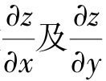.

**解** 把*y*看成常量，则*x*y是*x*的幂函数，由一元幂函数的求导公式，得

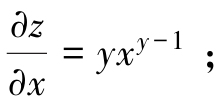

把*x*看成常量，则*x*y是*y*的指数函数，由一元指数函数的求导公式，得

**例4** 设*f*（*x，y*）=（*x*－1）*g*（*y*）+（*y*－1）*h*（*x*），求*fx*（1，1）.

**解** 由偏导数的定义可知，

**注** 本题也可用以下方法处理.

先写出*f*（*x*，1）=（*x*－1）*g*（1）+（1－1）*h*（*x*）=（*x*－1）*g*（1）；

再利用一元函数求导公式，函数对*x*求导，得*fx*（*x*，1）=*g*（1）；

最后代入*x*=1得*fx*（1，1）=*g*（1）.

**例5** 求三元函数*u*=sin（*x*+*y*2－*ez*）的偏导数.

**解** 把*y*和*z*看作常量，函数*u*对自变量*x*求导得

把*x*和*z*看作常量，函数*u*对自变量*y*求导得

把*x*和*y*看作常量，函数*u*对自变量*z*求导得

**例6** 已知一定量的理想气体的状态方程为*PV=RT*（*R*为常数），证明：

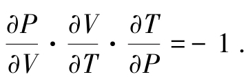

**解** 因为，把*T*看作常量，函数*P*对自变量*V*求导，得

同理，，把*P*看作常量，函数*V*对自变量*T*求导，得

，把*V*看作常量，函数*T*对自变量*P*求导，得

所以

关于多元函数的偏导数，补充以下几点说明.

（1）对一元函数而言，导数可看作函数的微分*dy*与自变量的微分*dx*的商．但偏导数的记号是一个整体，是不可分割的.

（2）与一元函数类似，对于分段函数在分段点的偏导数要利用偏导数的定义来求.

（3）在一元函数微分学中，我们知道，如果函数在某点存在导数，则它在该点必定连续．但对多元函数而言，即使函数在某点的各个偏导数都存在，也不能保证函数在该点连续.

例如，二元函数

在点（0，0）的偏导数为

但从上节例题已经知道这个函数在点（0，0）处不连续.

**2. 偏导数的几何意义**

设曲面的方程为*z=f*（*x，y*），*M*0（*x*0，*y*0，*f*（*x*0，*y*0））是该曲面上一点，过点*M*0作平面*y*=*y*0，截此曲面得一条曲线，其方程为

则偏导数*fx*（*x*0，*y*0）表示上述曲线在点*M*0处的切线*M*0*Tx*对*x*轴正向的斜率（见图6-8）．同理，偏导数*fy*（*x*0，*y*0）就是曲面被平面*x*=*x*0所截得的曲线在点*M*0处的切线*M*0*Ty}*对*y*轴正向的斜率（见图6-9）.

图6-8

图6-9

偏导数的几何意义

**3. 高阶偏导数**

设函数*z*=*f*（*x，y*）在区域*D*内具有偏导数

则在*D*内*fx*（*x，y*）和*fy*（*x，y*）都是*x*、*y*的函数．如果这两个函数关于自变量*x，y*的偏导数存在，则称它们是函数*z*=*f*（*x，y*）的**二阶偏导数**．按照对变量求导次序的不同，共有下列四个二阶偏导数：

其中第二、第三两个偏导数称为**混合偏导数**.

类似地，可以定义三阶、四阶及以上*n*阶偏导数．我们把二阶及二阶以上的偏导数统称为**高阶偏导数**.

**例7** 设*z*=4*x*3+3*x*2*y*－3*xy*2－*x+y*，求

**解**

**例8** 求*z*=*x*ln（*x+y*）的四个二阶偏导数.

**解**

**例9** 求函数*z*=*xy*的四个二阶偏导数.

**解**

**例10** 验证函数*u*（*x，y*）=满足方程

**证** 因为，

所以

从而

**注** 方程称为**拉普拉斯方程**，它代表数学物理方程中的一类很重要的方程，若引入记号（算子），则拉普拉斯方程可写成Δ*u*=0.

上述算子也称为**拉普拉斯算子**.

我们在例7、例8、例9中都看到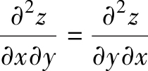，这不是偶然的．事实上，有如下的定理.

**定理1** 如果函数*z*=*f*（*x，y*）的两个二阶混合偏导数在区域*D*内连续，则在该区域内有.

证明从略.

这就是说，连续的二阶混合偏导数与求导次序无关.

### 二、全微分

在实际问题中，经常遇到需考虑用Δ*x*、Δ*y*的线性函数来代替全增量Δ*z*的问题，即多元函数的线性逼近.

对于二元函数*z*=*f*（*x，y*），它对某个自变量的偏导数表示当其中一个自变量固定时，因变量对另一个自变量的变化率．相应地，我们可以定义二元函数的偏增量和偏微分.

Δ*xz*=*f*（*x*+Δ*x*，*y*）－*f*（*x，y*）和Δ*yz*=*f*（*x，y*+Δ*y*）－*f*（*x，y*）分别称为二元函数对变量*x*与*y*的**偏增量**．固定自变量*y*，若Δ*xz*=*f*（*x*+Δ*x，y*）－*f*（*x，y*）=*A*Δ*x+o*（Δ*x*），当*fx*（*x，y*）存在时，则有*A*=*fx*（*x，y*），*fx*（*x，y*）Δ*x*称为二元函数*z*=*f*（*x，y*）**关于x的偏微分**．同理，可以定义**关于y的偏微分***fy*（*x，y*）Δ*y*.

根据一元函数微分学中增量与微分的关系，可得

*f*（*x*+Δ*x，y*）－*f*（*x，y*）≈*fx*（*x，y*）Δ*x*，

*f*（*x，y*+Δ*y*）－*f*（*x，y*）≈*fy*（*x，y*）Δ*y*.

在实际问题中，有时需要研究多元函数中各个自变量都取得增量时因变量所获得的增量，即所谓全增量的问题．下面我们看一个具体的问题.

设矩形的长和宽分别为*x*和*y*，则此矩形的面积*S*=*xy*．若边长*x*有增量Δ*x*，边长*y*有增量Δ*y*时（见图6-10），则面积*S*相应的增量为

Δ*S*=（*x*+Δ*x*）（*y*+Δ*y*）－*xy*=*y*Δ*x+x*Δ*y*+Δ*x*·Δ*y*.

图6-10

可见，Δ*S*包含两部分：第一部分是*y*Δ*x+x*Δ*y*，它是关于Δ*x*和Δ*y*的一次式；第二部分是Δ*x*·Δ*y*，它是关于的高阶无穷小，即

于是Δ*S*=*y*Δ*x+x*Δ*y+o*（*ρ*）.

一般地，如果函数*z*=*f*（*x，y*）在点*P*（*x，y*）的某邻域内有定义，并设*P′*（*x*+Δ*x，y*+Δ*y*）为这邻域内的任意一点，则称

*f*（*x*+Δ*x，y*+Δ*y*）－*f*（*x，y*）

为函数在点*P*对应于自变量增量Δ*x*、Δ*y*的**全增量**，记为Δ*z*，即

Δ*z*=*f*（*x*+Δ*x，y*+Δ*y*）－*f*（*x，y*）.

一般来说，计算全增量比较复杂．与一元函数的情形类似，我们也希望利用关于自变量增量Δ*x*、Δ*y*的线性函数来近似地代替函数的全增量Δ*z*，由此引入关于二元函数全微分的定义.

全微分的几何意义

**1. 全微分的定义**

**定义2** 如果函数*z*=*f*（*x，y*）在点（*x，y*）的全增量

Δ*z*=*f*（*x*+Δ*x，y*+Δ*y*）－*f*（*x，y*）

可以表示为

Δ*z*=*A*Δ*x+B*Δ*y+o*（*ρ*），

其中*A、B*不依赖于Δ*x*、Δ*y*，而仅与*x*、*y*有关，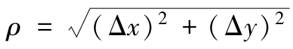，则称函数*z*=*f*（*x，y*）在点（*x，y*）**可微分**，*A*Δ*x+B*Δ*y*称为函数*z*=*f*（*x，y*）在点（*x，y*）的**全微分**，记为d*z*，即

d*z*=*A*Δ*x+B*Δ*y*.

若函数在区域*D*内各点处可微分，则称这函数在*D*内可微分.

由全微分的定义可知，矩形面积*S=xy*在（*x，y*）处的全微分d*S*=*y*Δ*x+x*Δ*y*.

**2. 函数可微的条件**

在学习一元函数的微分时，我们得到这样的结论：如果函数在某一点可微，则在该点处必连续，且在该点处可导.

对二元函数也有类似的性质，即有

**定理2（必要条件）** 如果函数*z*=*f*（*x，y*）在点（*x，y*）处可微分，则

（1）函数*z*=*f*（*x，y*）在点（*x，y*）连续；

（2）函数*z*=*f*（*x，y*）的两个偏导数都存在，且*z*=*f*（*x，y*）在点（*x，y*）处的全微分为

**证** （1）设函数*z*=*f*（*x，y*）在点（*x，y*）处可微分，则有

Δ*z*=*A*Δ*x+B*Δ*y+o*（*ρ*），

于是

因此函数*z*=*f*（*x，y*）在点（*x，y*）处连续.

（2）设函数*z*=*f*（*x，y*）在点（*x，y*）处可微分，则有

*f*（*x*+Δ*x，y*+Δ*y*）－*f*（*x，y*）=*A*Δ*x+B*Δ*y+o*（*ρ*）.

在上式中令Δ*y*=0，即

*f*（*x*+Δ*x，y*）－*f*（*x，y*）=*A*Δ*x+o*（\|Δ*x*\|），

两边同除以Δ*x*，再令Δ*x*→0，于是有

所以存在，且.

同理可证存在，且.

因此.

但是，两个偏导数存在，并不能保证函数*z*=*f*（*x，y*）在（*x，y*）处可微分．例如，在前面我们已经求得，函数

在（0，0）处的两个偏导数*fx*（0，0）和*fy*（0，0）存在，而它在点（0，0）处不连续，所以在点（0，0）处不可微.

我们知道，一元函数在某点可导是在该点可微的充分必要条件．但对于多元函数则不然．二元函数的各偏导数存在只是全微分存在的必要条件而不是充分条件.

由此可见，对于多元函数而言，偏导数存在并不一定可微分．因为函数的偏导数仅描述了函数在一点处沿坐标轴的变化率，而全微分描述了函数沿各个方向的变化情况．但如果对偏导数再加些条件，就可以保证函数的可微性.

**定理3（充分条件）** 如果函数*z*=*f*（*x，y*）的偏导数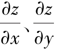在点（*x，y*）存在且连续，则函数在该点处可微分.

证明从略.

**3. 全微分的计算**

习惯上，常将自变量的增量Δ*x*、Δ*y*分别记为d*x*、d*y*，并分别称为自变量*x，y*的微分．这样，函数*z*=*f*（*x，y*）的全微分就表示为

上述关于二元函数全微分的必要条件和充分条件，可以完全类似地推广到三元及三元以上的多元函数中去．例如，三元函数*u*=*f*（*x，y，z*）的全微分可表示为

**例11** 求函数*z*=4*xy*3+5*x*2*y*6的全微分.

**解** 因为，且连续，所以

d*z*=（4*y*3+10*xy*6）d*x*+（12*xy*2+30*x*2*y*5）d*y*.

**例12** 计算函数*z*=*xy*在点（2，1）处的全微分.

**解** 因为*fx*（*x，y*）=*yxy－1*，*fy*（*x，y*）=*xy*ln*x*，所以

*fx*（2，1）=1，*fy*（2，1）=2ln2，

从而所求全微分为

d*z*=d*x*+2ln2d*y*.

**例13** 求函数*u*=*x*+sin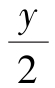+*eyz*的全微分.

**解** 由于

三个偏导数均连续，故所求全微分为

**例14** 求函数*u*=*xyz*的偏导数和全微分.

**解**

**\*4. 全微分在近似计算中的应用**

设二元函数*z*=*f*（*x，y*）在点*P*（*x，y*）的两个偏导数*fx*（*x，y*）、*fy*（*x，y*）连续，且\|Δ*x*\|、\|Δ*y*\|都较小时，则根据全微分定义，有

Δ*z*≈d*z*，

即

Δ*z*≈*fx*（*x，y*）Δ*x*+*fy*（*x，y*）Δ*y*.

由Δ*z*=*f*（*x*+Δ*x，y*+Δ*y*）－*f*（*x，y*），即可得到二元函数的全微分近似计算公式：

*f*（*x*+Δ*x，y*+Δ*y*）≈*f*（*x，y*）+*fx*（*x，y*）Δ*x*+*fy*（*x，y*）Δ*y*.

**例15** 计算（1.04）2.02的近似值.

**解** 设函数*f*（*x，y*）=*xy*，*x*=1，*y*=2，Δ*x*=0.04，Δ*y*=0.02.

*f*（1，2）=1，*fx*（*x，y*）=*yxy－1*，*fy*（*x，y*）=*xy*ln*x*，*fx*（1，2）=2，*fy*（1，2）=0，由二元函数全微分近似计算公式得

（1.04）2.02≈1+2×0.04+0×0.02=1.08.

**例16** 当*x*、*y*的绝对值很小时，推出函数（1+*x*）*m*（1+*y*）*n*的近似公式.

**解** 取*f*（*x，y*）=*xmyn*，（*x*0，y0）=（1，1），则由近似公式

*f*（*x*0+Δ*x，y*0+Δ*y*）≈*f*（*x*0，*y*0）+*fx*（*x*0，*y*0）Δ*x*+*fy*（*x*0，*y*0）Δ*y*

得 （1+Δ*x*）*m*（1+Δ*y*）*n*≈1+*m*Δ*x+n*Δ*y*，

因此当*x*、*y*的绝对值很小时，有

（1+*x*）*m*（1+*y*）*n*≈1+*mx*+*ny*.

**例17** 测得矩形盒的边长为75cm、60cm以及40cm，且可能的最大测量误差为0.2cm．试用全微分估计利用这些测量值计算盒子体积时可能带来的最大误差.

**解** 以*x、y、z*为边长的矩形盒的体积为*V=xyz*，所以

由于已知\|Δ*x*\|≤0.2，\|Δ*y*\|≤0.2，\|Δ*z*\|≤0.2，为了求体积的最大误差，取d*x*=d*y*=d*z*=0.2，再结合*x*=75，*y*=60，*z*=40，得

Δ*V*≈d*V*=60×40×0.2+75×40×0.2+75×60×0.2=1980，

即每边仅0.2cm的误差可以导致体积的计算误差最大达到1980cm3.

### 习题6-2

1\. 选择题.

（1）以下二元函数的性质中，（ ）是其他的充分条件.

A. 连续

B. 偏导数存在

C. 可微

D. 偏导数连续

（2）若函数*z*=*f*（*x，y*）在点*P*0（*x*0，*y*0）处两个偏导数存在，则在*P*0处（ ）.

A. 连续

B. 可微

C. 不一定连续

D. 一定不连续

（3）设*z*=*xy*，则=（ ）.

A. 1

B. e

C. 0

D. 

（4）设，则=（ ）.

A. 

B. 

C. 

D. 

（5）设*z*=*exy*，则d*z*=（ ）.

A. *exy*d*x*

B. （*x*d*y*+*y*d*x*）*exy*

C. *x*d*y*+*y*d*x*

D. （*x+y*）*exy*

2\. 填空题.

（1）设*z*=arctan（*xy*），则=_______；

（2）设，则*fy*（1，0）=_______；

（3）函数在点（1，1）的偏导数为_______；

（4）设*f*（*x，y*）=*x+y*－，则*fx*（3，4）=_______；

（5）设*z*=*f*2（*xy*），其中*f*可微，则=_______；

（6）设*u*=*ex+xy*，则全微分d*u*=_______；

（7）设，则d*z*\|（1，1）=_______；

（8）设，则d*u*\|（1，1，1）=_______.

3\. 计算下列函数的偏导数.

（1）*z*=cos（*xy*2）；

（2）*z*=ln（*x*2+*y*）；

（3）*z*=*ex+y*+*yx*2；

（4）；

（5）；

（6）.

4\. 求下列函数在指定点的偏导数.

（1）*z*=（2*y*+1）*x*，求；

（2），求*fy*（3，4）；

（3）*f*（*x，y*）=*x*+（*y*－1）arcsinx，求*fx*（*x*，1）；

（4）*f*（*x，y*）=*x*2+ln（*y*2+1）arctan*xy+1*，求*fx*（*x*，0）.

5\. 设，求证.

6\. 求曲线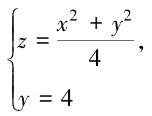，在点（2，4，5）处的切线关于*x*轴的斜率.

7\. 求下列三元函数的偏导数.

（1）*u*=*xyz*；

（2）.

8\. 求下列函数*z*=*f*（*x，y*）的二阶偏导数.

（1）*z*=2*x*2+3*xy*－*y*2；

（2）*z*=e*ax*cos*by*；

（3）*z*=cos2（2*x*+3*y*）；

（4）*z*=ln（*x*+*y*2）；

（5）*z*=arcsin（*xy*）；

（6）*z*=*x*sin（*x+y*）+*y*cos（*x+y*）.

9\. 求函数*z*=ln（1+*x*2+*y*2）当*x*=1，*y*=2时的全微分.

10\. 求函数，当*x*=2，*y*=1，Δ*x*=0.1，Δ*y*=－0.2时的全增量和全微分.

11\. 求下列函数的全微分.

（1）；

（2）*z*=ln（*x*2+*y*2）；

（3）；

（4）*u*=*x*2*yz*+cos2y.

12\. 设，求d*z*\|（1，1）.

13\. 设*z*=*x*ln（*xy*），求.

14\. 证明函数满足拉普拉斯方程：

其中.

\*15. 求的近似值.

\*16. 当*x*、*y*的绝对值很小时，推出函数arctan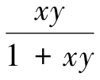的近似公式.

\*17. 已知边长为*x*=6m与*y*=8m的矩形，如果*x*边增加5cm而*y*减少10cm，问这个矩形的对角线的近似变化怎样？

\*18. 设函数讨论该函数在（0，0）点的连续性、可导性与可微性.

\*19. 设试求*fxy*（0，0）及*fyx*（0，0）.

## 第三节 复合求导、隐函数求导及方向导数

［课前导读］

设*u*=*φ*（*x*）在点*x*可导，而*y*=*f*（*u*）在对应点*u*处可导，则复合函数*y*=*f*［*φ*（*x*）］在点*x*处可导，且有．这就是一元函数的复合求导的“链式法则”，函数之间的关系可以用这样的结构图来表示：*y*→*u*→*x*.

这一法则可以推广到多元复合函数的情形．由于多元函数的构成比较复杂，所以一元函数的“链式图”就转化为多元函数的“树图”.

例如，*u*=*f*（*x，y，z*）用结构图来表示就是

而*z*=*f*（*x，y*）与*y*=*φ*（*x*）复合而成的函数*z*=*f*（*x，φ*（*x*））的结构图为

### 一、多元函数复合求导

**1. 复合函数的中间变量为一元函数的情形**

**定理1** 设*u*=*u*（*t*），*v=v*（*t*）均在*t*处可导，函数*z*=*f*（*u，v*）在对应点（*u，v*）处有连续的偏导数，则它们构成的复合函数*z*=*f*［*u*（*t*），*v*（*t*）］在*t*处可导，且有导数公式

公式（1）中的导数称为**全导数**.

对于此定理我们不予证明，只用结构图来做一下说明.

公式（1）的右边是偏导数与导数乘积的和式，它与函数自身的结构有密切的关系.*z*是*u、v*的二元函数，而*u*和*v*都是*t*的一元函数，我们用函数的结构图来表示，就是

从结构图中可以看出，*z*通过中间变量*u*和*v*到达*t*有两条“路径”，而公式（1）右侧恰好有两式相加，而每条“路径”上都是两项的乘积，是对应的函数的偏导数和导数的乘积.

这种方法可以推广到三元函数的情形，例如，设*u*=*u*（*t*），*v=v*（*t*），*w=w*（*t*）均在*t*处可导，*z*=*f*（*u，v，w*）在对应点处具有连续的偏导数，求复合函数*z*=*f*［*u*（*t*），*v*（*t*），*w*（*t*）］的全导数.

函数的结构图是

从函数的结构图中可以看出，由*z*经中间变量*u、v、w*到达*t*有三条“路径”，因此公式中应该是三项之和，所以它的全导数为

**例1** 设*z*=*uv*，而*u*=*et*，*v*=cos*t*，求导数.

**解** 由公式（1）知

**注** 我们也可以把*u*=*et*，*v*=cos*t*表达式代入到*z*=*uv*中，即*z*=*et*cos*t*，然后直接求一元函数的导数.

**例2** 设*z*=ln（*u+v*）+*et*，而*u*=2*t*，*v=t*2，求导数.

**解** 函数的结构图为

因此

**注** 解中的的含义是不一样的.

表示复合以后的一元函数*z*=*f*［*u*（*t*），*v*（*t*），*w*（*t*）］对*t*的全导数，而表示复合前的三元函数*z*=ln（*u+v*）+*et*对第三个自变量*t*的偏导数.

**2. 复合函数的中间变量为多元函数的情形**

**定理2** 设*u*=*u*（*x，y*），*v=v*（*x，y*）在点（*x，y*）处都具有偏导数，函数*z*=*f*（*u，v*）在对应点（*u，v*）具有连续的偏导数，则复合函数*z*=*f*［*u*（*x，y*），*v*（*x，y*）］在（*x，y*）处的两个偏导数存在，并有求导公式：

定理证明从略.

定理2中的复合函数的结构图是

我们可以借助函数结构图，利用前面分析的方法与结论，直接写出式（2）和式（3）的求导公式.

**例3** 设*z*=*eu*sin*v*，而*u=xy，v=x+y*，求.

**解** 由式（2）和式（3）可得

**例4** 求*z*=（3*x*2+*y*2）4x+2y的两个偏导数.

**解** 设*u*=3*x*2+*y*2，*v*=4*x*+2*y*，则*z*=*uv*.

于是

则

这种类型的题目也可以用全微分的方法来解决，感兴趣的读者可以试一下.

**3. 复合函数的中间变量既有一元函数也有多元函数的情形**

这种情形可以视为定理2的特例，我们仅以一种情况为例，其他的类似可得.

**定理3** 如果函数*u*=*u*（*x，y*）在点（*x，y*）具有对*x*和*y*的偏导数，函数*v=v*（*y*）在点*y*可导，函数*z*=*f*（*u，v*）在对应点（*u，v*）具有连续偏导数，则复合函数*z*=*f*［*u*（*x，y*），*v*（*y*）］在对应点（*x，y*）的两个偏导数存在，且有

定理证明从略.

该复合函数的结构图为

**例5** 设函数*z*=*eu2+v2*，而*u*=*x*2sin*y*，*v*=cos*y*，求

**解** 由式（4）和式（5）可知，

**例6** 设*z*=*f*（*x，y，u*）=（*x－y*）*u*，*u*=*xy*，求.

**解** 函数的结构图为

其中*x*、*y*既是复合函数的中间变量，又是自变量．则

**注** 等号两边都有，但这两个符号的含义是不一样的，左边的是二元函数*z*=（*x－y*）*xy*对*x*的偏导数，右边的是三元函数*z*=*f*（*x，y，u*）=（*x－y*）*u*对*x*的偏导数．为了表示区别，等号右边的常写作．同理，等号两边的的含义也是不一样的，等号右边的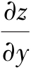也常写作.

**例7** 设*z*=*f*（sin*x*，*x*2－*y*2），*f*具有一阶连续的偏导数，求.

**解** 设*u*=sin*x*，*v*=*x*2－*y*2，则函数*z*=*f*（sin*x*，*x*2－*y*2）是由函数*z*=*f*（*u，v*），*u*=sin*x*，*v*=*x*2－*y*2复合而成．由函数的结构图

可得

**注** 有时，为表达简便起见，引入以下记号：

这里下标1表示对第一个变量求偏导数，下标2表示对第二个变量求偏导数，利用这样的记号，例7的结果可以表示为

同理，也可以引入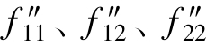等记号.

**例8** （1）设*u*=*f*（*x+z，xyz*），其中*f*具有二阶偏导数，求；

（2）设*u*=*f*（*xy，xyz*），其中*f*具有二阶连续偏导数，求.

**解** （1）

**注** 本题条件中并没有二阶偏导数连续，因此未必相等，因此不要将其合并.

（2）

**注** 本题条件中有二阶偏导数连续，因此，因此需要将其合并.

**例9** 设函数*u*=*f*（*x，y*）具有二阶连续偏导数，将下列表达式转换为极坐标的形式.

（1）；

（2）.

**解** （1）直角坐标系与极坐标系的关系为

因此

（2）

同理，

因此，

**注** 也可将*r*、*θ*看作是自变量，*x*、*y*看作是中间变量.

以上两式联立，解出

**4. 全微分形式的不变性**

设函数*z*=*f*（*u，v*）可微，则有

如果*u*=*u*（*x，y*），*v=v*（*x，y*）可微，则*z*=*f*（*u*（*x，y*），*v*（*x，y*））=（*x，y*）也可微，从而

可以看出，无论*z*是自变量*u*、*v*的函数，还是中间变量*u*、*v*的函数，它的全微分形式是一样的，这个性质就叫作全微分形式的不变性.

**例10** 设*z*=（*x－y*）x2+y2，求.

**解**

代入并归并含d*x*及d*y*的项，得

### 二、隐函数的求导公式

在一元微分学中，我们曾引入了隐函数的概念，并介绍了不经过显化而直接由方程

*F*（*x，y*）=0

来求它所确定的隐函数*y*=*f*（*x*）的导数的方法.

那时，实际上假定方程*F*（*x，y*）=0能确定*y*是*x*的函数*y*=*f*（*x*），函数*y*=*f*（*x*）具有导数*y′*．但是事实上并不是任何一个方程*F*（*x，y*）=0都能确定*y*是*x*的函数，且使*y*=*f*（*x*）可导．那么，在什么条件下，从方程*F*（*x，y*）=0中可以确定*y*是*x*的函数？这个函数是否可导？如何来求该导数？现在我们来回答这些问题.

**1. 一个方程的情形**

**定理4（隐函数存在定理1）** 设函数*F*（*x，y*）在点*P*（*x*0，*y*0）的某一邻域内具有连续的偏导数，且

*Fy*（*x*0，*y*0）≠0，*F*（*x*0，*y*0）=0，

则方程*F*（*x，y*）=0在点*P*（*x*0，*y*0）的某一邻域内恒能唯一确定一个连续且具有连续导数的函数*y*=*f*（*x*），它满足*y*0=*f*（*x*0），并有

本定理不作严格证明，仅就结论作以下推导.

方程*F*（*x，y*）=0在点*P*0（*x*0，*y*0）的某邻域内恒能唯一确定一个连续函数*y*=*f*（*x*），则将*y*=*f*（*x*）“代入”*F*（*x，y*）=0，使其成为恒等式：*F*（*x，f*（*x*））≡0.

等式左边的函数*F*（*x，f*（*x*））是一个复合函数，它的函数结构图为

求此方程的全导数，

由于*Fy*（*x，y*）连续，且*Fy*（*x*0，*y*0）≠0，因此存在*P*0（*x*0，*y*0）的一个邻域，在这个邻域内，*Fy*（*x，y*）≠0，于是得.

**注** 如果*F*（*x，y*）的二阶偏导数也连续，则可把上面等式两端看作*x*的复合函数而再次求导，得

**例11** 验证方程*x*2+*y*2－1=0在点（0，1）的某邻域内能唯一确定一个有连续导数，当*x*=0时*y*=1的隐函数*y*=*f*（*x*），并求这函数的一阶和二阶导数在*x*=0的值.

**证** 令*F*（*x，y*）=*x*2+*y*2－1，则

*Fx*=2*x*，*Fy*=2*y*，*Fx*（0，1）=0，*Fy*（0，1）=2≠0，

依定理4知方程*x*2+*y*2－1=0在点（0，1）的某邻域内能唯一确定一个有连续导数，当*x*=0时*y*=1的隐函数*y*=*f*（*x*），函数的一阶和二阶导数为

**例12** 求由方程*xy*－*ex*+*ey*=0所确定的隐函数*y*的导数.

**解** 令*F*（*x，y*）=*xy*－*ex*+*ey*，则

由原方程知*x*=0时，*y*=0，所以

**例13** 求由方程*x*－*y*－*ey*=0确定的隐函数的导数.

**解** 取*F*（*x，y*）=*x*－*y*－*ey*，则*Fx*=1，*Fy*=－1－*ey*≠0，因此

**注** 本题也可用复合函数求导的方法解.

在方程*x*－*y*－*ey*=0两端关于*x*求导，得

整理得

再在式（\*）两端关于*x*求导，得

整理得

隐函数存在定理可以推广到三元以及三元以上的方程的情形.

**定理5（隐函数存在定理2）** 设函数*F*（*x，y，z*）在点*P*（*x*0，*y*0，*z*0）的某一邻域内有连续的偏导数，且

*F*（*x*0，*y*0，*z*0）=0，*Fz*（*x*0，*y*0，*z*0）≠0，

则方程*F*（*x，y，z*）=0在点*P*（*x*0，*y*0，*z*0）的某一邻域内恒能唯一确定一个连续且具有连续偏导数的函数*z=f*（*x，y*），它满足条件*z*0=*f*（*x*0，*y*0），并有

我们同样只给出定理最后结论的推导过程.

将*z*=*f*（*x，y*）代入方程*F*（*x，y，z*）=0，得恒等式

*F*（*x，y，f*（*x，y*））≡0，

等式左端是*x，y*的复合函数，恒等式两边分别对*x，y*求偏导数，由链式法则得

于是有

这就是隐函数*z*=*f*（*x，y*）的偏导数公式.

**例14** 求由方程所确定的隐函数*z*=*f*（*x，y*）的偏导数.

**解** 设，则*F*（*x，y，z*）=0，且

利用隐函数求导公式，当*Fz*≠0时得

其中*z*=*z*（*x，y*）由方程确定.

**注** 本例也可以用其他方法求得两个一阶偏导数，例如：

在两端关于*x*求导，得

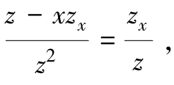

整理得；在两端关于*y*求导，得，整理得

或者在两端微分，得，

整理得.

**2. 方程组情形**

**定理6（隐函数存在定理3）** 设函数*F*（*x，y，u，v*）、*G*（*x，y，u，v*）在点*P*0（*x*0，*y*0，*u*0，*v*0）的某个邻域内具有对各个变量的一阶连续偏导数，又*F*（*x*0，*y*0，*u*0，*v*0）=0，*G*（*x*0，*y*0，*u*0，*v*0）=0，且在点*P*0（*x*0，*y*0，*u*0，*v*0）处偏导数所组成的函数行列式（也称雅可比（Jacobi）行列式），则方程组在点*P*0（*x*0，*y*0，*u*0，*v*0）的某个邻域内恒能唯一确定一组连续且具有连续偏导数的函数*u*=*u*（*x，y*）、*v=v*（*x，y*），它们满足条件*u*0=*u*（*x*0，*y*0），*v*0=*v*（*x*0，*y*0），并且

上述公式比较复杂，我们可以通过推导，注意它的形成过程，这样对记忆有帮助．比如可通过微分：

然后解出.

也可将函数*u*=*u*（*x，y*），*v=v*（*x，y*）“代入”即得

方程组关于*x*求偏导，得

然后解出.

同理，关于*y*求偏导，得

然后解出.

**例15** 设*u*=*u*（*x，y*），*v=v*（*x，y*）由方程组，确定，求.

这道题目可以用公式做，也可以用推导法解得，我们采取推导法.

**解法一** 在方程组两端微分，得

整理得

即.

**解法二** 在方程组两端关于*x*求导，得

整理得

类似得

**例16** 设函数*y*=*y*（*x*），*z*=*z*（*x*）由方程组确定，试求.

**解** 将方程组两端微分，得

消去d*z*，得

同理，消去d*y*，得

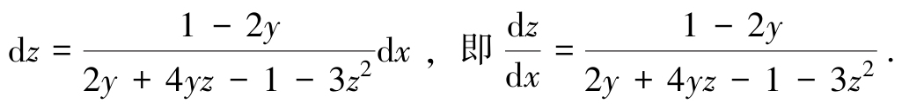

**例17** 设函数*x*=*x*（*u，v*），*y*=*y*（*u，v*）在点（*u，v*）的某个邻域内连续且具有一阶连续偏导数，

**解** 设在点（*x，y，u，v*）的某个邻域内连续且具有一阶连续偏导数，且

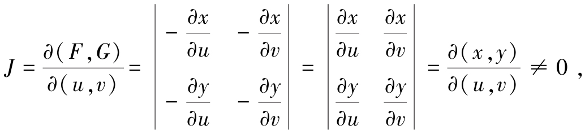

故在点（*x，y*）的某个邻域内存在连续且具有一阶连续偏导数的反函数*u*=*u*（*x，y*），*v=v*（*x，y*）.

由得

因此

### 三、方向导数与梯度

偏导数反映的是函数沿坐标轴方向的变化率，但在实际问题中，只考虑沿坐标轴方向的变化率是不够的．例如，热空气要向冷的地方流动，气象学需要考虑大气温度、气压沿着某个方向的变化率，因此我们需要研究函数沿任意指定方向的变化率问题．方向导数就是反映函数在一点处沿一条特定的射线方向的变化率.

**1. 方向导数**

设函数*z*=*f*（*x，y*）在点*M*0（*x*0，*y*0）的某个邻域*U*（M0）内有定义，**l**是以*M*0（*x*0，*y*0）为始点的一条射线，它与*x*轴正向的夹角为*α*，*M*（*x，y*）为l上任一点．设\|*MM*0\|=*ρ*，故有*x*=*x*0+*ρ*cos*α*，*y*=*x*0+*ρ*sin*α*（见图6-11），若存在，则称此极限为函数*z*=*f*（*x，y*）在点*M*0（*x*0，*y*0）沿方向**l**的**方向导数**，记作.

即

图6-11

从方向导数的定义可知，方向导数就是函数*f*（*x，y*）在点*M*0（*x*0，*y*0）处沿方向**l**的变化率．偏导数存在只能推出沿*x*轴、*y*轴平行方向的方向导数存在，不能得到其他方向的方向导数存在．例如，若函数*f*（*x，y*）在点*M*0（*x*0，*y*0）的偏导数存在，**e***l*=**i**=（1，0），从而

又**e***l*=**j**=（0，1），从而

方向导数的几何意义

而方向导数存在不能得到偏导数存在，方向导数是单侧极限（*ρ*≥0），而的定义中要求*x*无论是从*x*0的左侧还是右侧趋于*x*0时极限存在且相等．例如，在点（0，0）处沿方向**e***l*=**i**=（1，0）的方向导数为，而不存在.

的情况类似.

方向导数的存在与计算见以下定理.

**定理7** 若*z*=*f*（*x，y*）在点*M*0（*x*0，*y*0）处可微分，则*z*=*f*（*x，y*）在该点处沿任一方向**l**的方向导数均存在，且，其中*α*为方向**l**与*x*轴正向的夹角，cos*α*和sin*α*即为方向*l*的方向余弦，即**e***l*=（cos*α*，sin*α*）.

**证** 由*z*=*f*（*x，y*）在点*M*0（*x*0，*y*0）处可微知，Δ*z*可表示成

其中．上式两端除以*ρ*，得

令*ρ*→0，取极限，则得.

**注** 根据定理7的条件可知，函数可微分则其方向导数存在，但方向导数存在，函数未必一定可微分.

**例18** 求函数*z*=*x*2－*xy*+*y*2在点*M*0（1，1）处沿与*Ox*轴正向成的方向**l**上的方向导数.

**解** ，此两个偏导数在**R**2上连续，因此函数*z*可微分，因此

**例19** 求函数*z*=*xy+sin*（*x*+2*y*）在点*O*（0，0）处沿方向**l**=（1，2）上的方向导数.

**解** ，此两个偏导数在**R**2上连续，因此函数*z*可微分，与**l**同方向的单位向量为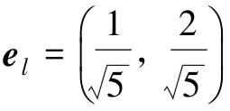，因此

对于三元函数*u*=*f*（*x，y，z*），其在空间一点*M*0（*x*0，*y*0，*z*0）沿方向**e***l*=（cos*α*，cos*β*，cos*γ*）的方向导数为

同样可以证明：若*u*=*f*（*x，y，z*）在点*M*0（*x*0，*y*0，*z*0）处可微，则*u*=*f*（*x，y，z*）在该点处沿任一方向**l**的方向导数均存在，且

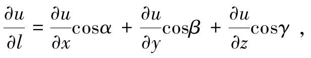

其中cos*α*，cos*β*，cos*γ*是方向**l**的方向余弦.

**例20** 求函数*u*=*xy+yz+zx*在点（1，1，2）处沿方向**l**上的方向导数，其中**l**的方向角分别为60°，45°，60°.

**解** ，此三个偏导数在**R**3上连续，因此函数可微分，与**l**同方向的单位向量为**e***l*=（cos60°，cos45°，cos60°）=，因此

**例21** 求函数*u*=*x*sin*yz*在点（1，3，0）处沿方向**l**=（1，2，－1）上的方向导数.

**解** ，此三个偏导数在R3上连续，因此函数可微分，与**l**同方向的单位向量为，因此

**2. 梯度**

方向导数反映了函数沿某射线方向的变化率．一般说来，一个二元函数在给定点处沿不同方向的方向导数是不一样的．在许多实际问题中需要讨论：函数沿哪个方向的方向导数为最大？为此，我们引进下面的梯度概念.

**定义** 设*z*=*f*（*x，y*）在平面区域*D*内具有一阶连续偏导数，则对于每一点（*x，y*）∈*D*，称为*z*=*f*（*x，y*）在点（*x，y*）处的**梯度**，记作**grad***z*，即**grad***z*=.

若记，则**grad***z*=▽*z*.

由方向导数的公式，若*z*=*f*（*x，y*）具有一阶连续偏导数，则

其中**e***l*=（cos*α*，sin*α*），.

由此可知，函数在一点的梯度是这样一个向量，它的方向是函数在这点的方向导数取得最大值的方向，且最大值等于梯度的模.

**例22** 求.

**解** 这里.

因为

所以

**例23** 设*z*=*f*（*x，y*）=*x*e*y*.

（1）求出*f*在点*P*（2，0）处沿从*P*到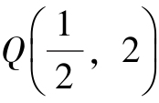方向的变化率；

（2）*f*在点*P*（2，0）处沿什么方向具有最大的增长率，最大增长率为多少？

**解** （1）设**e***l*是与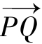同方向的单位向量，则，又

▽*f*（*x，y*）=（e*y*，*x*e*y*），

所以

（2）*f*在点*P*（2，0）处沿▽*f*（2，0）=（1，2）方向具有最大的增长率，最大增长率为\|▽*f*（2，0）\|=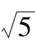.

梯度的概念可以自然地推广到*n*元函数，以三元函数为例，设*u*=*f*（*x，y，z*）具有一阶连续偏导数，则梯度为

**例24** 求函数*f*（*x，y，z*）=（*x*－1）2+2（*y*+1）2+3（*z*－2）2－6在点（2，0，1）处沿向量（1，－2，－2）方向的方向导数.

**解**

因此

**\*3．数量场与向量场简介**

所谓场，就是一种分布．气压、气温、电位、电场强度、流体密度、速度等由空间位置及时间所确定的物理量，它们在空间或在部分空间上的分布就称为**场**.

若形成场的物理量是数量，则称为**数量场**，即如果对于空间区域*G*内的任一点*M*，都有一个确定的数量函数*f*（*M*），则称在空间区域*G*内确定了一个数量场；一个数量场可用一个数量函数*f*（*M*）来确定，比如，大气温度的分布、流体密度的分布都形成数量场.

若形成场的物理量是向量，则称为**向量场**，即如果对于空间区域*G*内的任一点*M*，都有一个确定的向量值函数*f*（*M*），则称在空间区域*G*内确定了一个向量场；一个向量场可用一个向量值函数*f*（*M*）来确定，比如，流体流动的速度、电场强度的分布都形成向量场.

若向量场*f*（*M*）是某个数量函数*f*（*M*）的梯度场**grad***f*（*M*），则称*f*（*M*）是向量场*f*（*M*）的一个势函数，并称向量场*f*（*M*）是一个势场.

**注** 任何一个向量场并不一定都是势场，因为它不一定是某个数量函数的梯度场.

**例25** 试求数量场所产生的梯度场，其中常数*m*\>0，为原点*O*到点*M*（*x，y，z*）的距离.

**解** 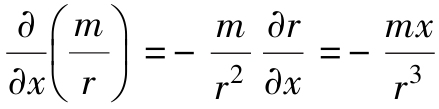，同理，，故

若用**e***r*表示与同方向的单位向量，即，则

上式右端在力学上可解释为：位于原点*O*而质量为*m*的质点对位于点*M*而质量为1的质点的引力．这引力的大小与两质点的质量的乘积成正比，而与它们之间的距离平方成反比，这引力的方向由点*M*指向原点．因此数量场的势场即梯度场**grad**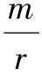称为**引力场**，而函数称为**引力势**.

### 习题6-3

1\. 下列函数确定了*z*是*t*的函数，求.

（1）*z*=e*uv*，*u*=sin*t*，*v*=cos*t*；

（2）设*z*=arcsin（*x－y*2），*x*=3*t*，*y*=4*t*2；

（3）*z*=ln（*x+y*）+arctan*t*，*x*=2*t*，*y*=2*t*3；

（4）*z*=tan（3*t*+2*x*2－*y*2），.

2\. 设*z*=*u*2ln*v*，，*v*=2*x*－3*y*，求.

3\. 设*z*=e*u*sin*v*，而*u*=*xy*，*v*=*x+y*，求.

4\. 设*z*=*x*2*y*－*xy*2，*x*=*r*cos*θ*，*y*=*r*sin*θ*，求.

5\. 设*u*=sin*x*+*F*（sin*y*－sin*x*），其中*F*是可微函数，证明：

6\. 设*f*具有一阶连续偏导数，求下列函数的一阶偏导数.

（1）*z*=*f*（3*x*+2*y*，4*x*－3*y*）；

（2）*z*=*f*（*x*2－*y*2，e*xy*）；

（3）*z*=*f*（*y*ln*x*，2*x*+3*y*）；

（4）；

（5）*z*=*f*（*x，x+y，x－y*）；

（6）*u*=*f*（*x，xy，xyz*）.

7\. 设*w=f*（*x+xy+xyz*），求.

8\. 设*z*=*f*（e*xy*，*x*2－*y*2），其中*f*（*ξ，η*）有连续的二阶偏导数，求.

9\. 设*w=f*（*x+y+z*，*xyz*），其中函数*f*有二阶连续偏导数，求.

10\. 设*z*=*f*（*x*2+*y*2），其中函数*f*有二阶连续偏导数，求.

11\. 设*z*=*f*（*u，x，y*），而*u*=*x*e*y*，其中函数*f*有二阶连续偏导数，求

12\. 设*z*=e*u*sin*v*，而*u*=*xy*，*v*=*x+y*，利用全微分形式不变性求*zx*和*zy*.

13\. 利用一阶全微分形式的不变性求函数的偏导数.

14\. 下列方程确定了*y*是*x*的函数，求.

（1）sin*y*+e*x*－*xy*2=0；

（2）；

（3）*y*=1+*x*e*y*；

（4）*xy*=*yx*.

15\. 下列方程确定了*z*是*x*、*y*的函数，求

（1）e*x*－*xyz*=0；

（2）*z*3－3*xyz*=0；

（3）2*xz*+ln（*xyz*）=0；

（4）sin（*x*－2*y*+3*z*）=*x*+2*y*－3*z*；

（5）*x*2+*y*2+2*x*－2*yz*=e*z*；

（6）*z*3－3*xyz*=*a*3（*a*是常数）.

16\. 设*x*2+*y*2+*z*2－4*z*=0，求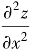.

17\. 设*z*=*z*（*x，y*）由方程*x*2+*y*2+*z*2=*yf*（*z*）所确定（其中*yf*′≠2*z*），试求.

18\. 设*x*2+*y*2+*z*2=3*xyz*（\*），*f*（*x，y，z*）=*xy*2*z*3.

（1）设*z*=*z*（*x，y*）是由方程（\*）所确定的隐函数，求*fx*（1，1，1）；

（2）设*y*=*y*（*x，z*）是由方程（\*）所确定的隐函数，求*fx*（1，1，1）.

19\. 设方程*x+y+z*=e*z*确定了隐函数*z*=*z*（*x，y*），求.

20\. 设*z*=*xy+u*，*u*=*φ*（*x，y*），求.

21\. 求下列方程组确定的函数的导数或偏导数.

（1）

（2）

（3）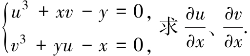

（4）

22\. 设函数*u*=*x*2+*yz*，而*z*=*z*（*x，y*）是由方程*z*=*f*（*x，y+z*）确定的可微函数，其中*f*具有连续的偏导数且，求偏导数.

23\. 设*y*=*f*（*x，t*），其中*t*=*t*（*x，y*）由方程*F*（*x，y，t*）=0确定，求*y*对*x*的导数，其中函数*f*、*F*均可微.

24\. 设*u*=*f*（*x，y，z*），*y*=*φ*（*x，t*），*t*=*ψ*（*x，z*），其中*f*、*φ*、*ψ*均可微，求.

25\. 设函数*z*=*f*（*x*2－*y*2，*xy*），其中*f*具有二阶连续偏导数，求.

26\. 设函数，其中*f*具有二阶连续偏导数，求.

27\. 设函数*f*（*u*）可微，*φ*′（*u*）连续且*φ*′（*u*）≠1，*P*（*t*）连续，又*z*=*f*（*u*）且*u*=*φ*（*u*）+，求.

28\. 设*z*=*z*（*x，y*）为可微函数，且当*y*=*x*2时有*z*（*x，y*）=1及，求当*y*=*x*2时的.

29\. 设*u*=*f*（*z*），*z*=*y+xφ*（*z*），其中*f*、*φ*可导且1－*xφ*′（*z*）≠0，求.

30\. 设函数*u*（*x，y*）满足方程，其中*u*（*x，y*）具有二阶连续偏导数，*F*具有不同时为零的偏导数，求.

31\. 求函数*z*=*x*2+*y*2在点（1，2）处沿从该点到点（2，2+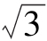）的方向的方向导数.

32\. 求函数*z*=cos（*x+y*）在点处沿向量（3，－4）的方向的方向导数.

33\. 求函数*z*=ln（*x*2+*y*2）在点（1，1）处沿方向余弦的方向的方向导数.

34\. 求函数*u*=*xy*2+*z*3－*xyz*在点（1，1，2）处沿方向角的方向的方向导数.

35\. 求函数在点（1，1，1）处沿向量（2，1，－1）的方向的方向导数.

36\. 设*f*（*x，y，z*）=*x*2+*y*2+*z*2，求**grad***f*（1，－1，2）.

37\. 求函数*u*=*x*2+2*y*2+3*z*2+3*x*－2*y*在点（1，1，2）处的梯度，并问在哪些点处梯度为零？

38\. 求函数*u*=*xy*2+*z*3－*xyz*在点*P*0（1，1，1）处沿哪个方向的方向导数最大？最大值是多少？

39\. 设*f*（*r*）为可微函数，*r*=\|**r**\|，**r**=*x***i**+*y***j**+*z***k**．求**grad***f*（*r*）.

40\. 设向量**u**=3**i**－4**j**，**v**=4**i**+3**j**，函数*f*（*x，y*）在点*P*处可微且，求d*f*\|*P*.

41\. 一块金属板在*xOy*平面上占据的区域是*D*={（*x，y*）\|0≤*x*≤1，0≤*y*≤1}，已知板上各点的温度是*T*=*xy*（1－*x*）（1－*y*），在点处有一条昆虫，为了尽可能快地逃到冷的地方，它应当按什么方向运动？

42\. 求函数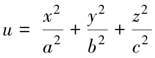（其中常数*a*\>0，*b*\>0，*c*\>0）在已知点*M*（*x，y，z*）处沿此点的向径**r**的方向导数，并问当*a*、*b*、*c*为何关系时，才能使方向导数等于梯度的模.

## 第四节 多元函数微分学的应用

［课前导读］

在一元函数微分学中，我们介绍了平面曲线的切线和法线.

一元函数*y*=*f*（*x*），*x*∈*D*，*f*（*x*）在*D*上可导．函数在某一点*x*0∈*D*的切线斜率为*k*=*f*′（*x*0）≠0，对应的切线方程为*y*－*y*0=*f*′（*x*0）（*x－x*0）；法线方程为（*x－x*0）+*f*′（*x*0）（*y－y*0）=0.

若一元函数用参数方程，*t*∈［*α，β*］来表示，其中*φ*（*t*），*ψ*（*t*）在［*α，β*］上可导，且导数*φ*′（*t*）≠0．则在点*t*0∈（*α，β*）处的切线斜率为，对应的切线方程为；法线方程为*φ*′（*t*0）（*x－x*0）+*ψ*′（*t*0）（*y－y*0）=0.

### 一、空间曲线的切线与法平面

类似于平面曲线切线的概念，一条空间曲线*Γ*在点*M*0（*x*0，*y*0，*z*0）∈*Γ*处的切线是这样定义的：在曲线*Γ*上任取一点*M*（*x*0+Δ*x*，*y*0+Δ*y*，*z*0+Δ*z*），作割线*M*0*M*，则当点*M*沿曲线*Γ*趋近于*M*0时，割线的极限位置*M*0*T*称为空间曲线*Γ*在点*M*0（*x*0，*y*0，*z*0）处的**切线**，点*M*0为**切点**（见图6-12）.

图6-12

过点*M*0（*x*0，*y*0，*z*0）并与空间曲线*Γ*在点*M*0处的切线*M*0*T*垂直的平面称为空间曲线*Γ*在点*M*0处的**法平面**.

**1. 空间曲线的切线和法平面**

设空间曲线*Γ*的参数方程为，*t*∈［*α，β*］，其中*φ*（*t*）、*ψ*（*t*）、*ω*（*t*）在［*α，β*］上可导，且不同时为零.

现在要求曲线*Γ*上一点*M*0（*x*0，*y*0，*z*0）处的切线方程和法平面方程.

设与点*M*0对应的参数为*t*0，与点*M*（*x*0+Δ*x*，*y*0+Δ*y*，*z*0+Δ*z*）对应的参数为*t*0+Δ*t*，显然，当*M*→*M*0时，有Δ*t*→0.

由于向量（Δ*x*，Δ*y*，Δ*z*）是割线*M*0*M*的一个方向向量，点*M*0（*x*0，*y*0，*z*0）在割线上，于是割线的方程为

上式各个分母同除以Δ*t*，得

令*M*→*M*0，相应地Δ*t*→0，对上式分母求极限，便得到空间曲线在点*M*0处的切线方程，即

向量**τ**\|*t=t0*=（*φ*′（*t*0），*ψ*′（*t*0），*ω*′（*t*0））是切线的方向向量，又叫作**切向量**.

由于曲线*Γ*在点*M*0处的切线与法平面垂直，可知此法平面的法向量正是切线的方向向量（切向量），因此法平面的点法式方程为

*φ*′（*t*0）·（*x－x*0）+*ψ*′（*t*0）·（*y－y*0）+*ω*′（*t*0）·（*z－z*0）=0.

**注** 求空间曲线的切线与法平面方程的关键在于求出其切向量.

**例1** 求曲线（*a，b*∈**R**，*a*≠0，*b*≠0），在点*M*0（*a*，0，0）的切线和法平面方程.

**解** 点*M*0（*a*，0，0）对应的参数为*t*=0，由于

所以，曲线在点*M*0（*a*，0，0）处的切线方程为

即

法平面方程为

*ay+bz*=0.

**例2** 求曲线在对应点的切线及法平面方程.

**解** **τ**=（*a*sin2*t*，*b*cos2*t*，－*c*sin2*t*），，时曲线上对应点坐标为，因此所求切线方程为

法平面方程为，即

**例3** 在曲线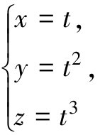上求出一点，使此点的切线平行于平面*x*+2*y+z*－4=0.

**解** 曲线的切向量为，已知平面的法向量为**n**=（1，2，1），由**τ**⊥**n**，即**τ·n**=1+4*t*+3*t*2=0，得，*t*2=－1，因此所求点为和（－1，1，－1）.

**2. 空间曲线的切线和法平面**

若空间曲线*Γ*是以两个柱面的交线的形式给出，比如则可取*x*为参数，有其任一点处的切向量为**τ**=（1，*ψ*′（*x*），*ω*′（*x*））.

因此，空间曲线在点*M*0（*x*0，*y*0，*z*0）处的切线方程为

法平面方程为

（*x－x*0）+*ψ*′（*x*0）·（*y－y*0）+*ω*′（*x*0）·（*z－z*0）=0.

**例4** 求曲线在点*M*（1，2，4）处的切线及法平面方程.

**解** **τ**=（1，6*x*2，1），**τ**\|*x*=1=（1，6，1），

因此所求切线方程为

法平面方程为

（*x*－1）+6（*y*－2）+（*z*－4）=0，

即

*x*+6*y+z*－17=0.

**3. 空间曲线的切线和法平面**

若空间曲线*Γ*是以一般方程形式（两个曲面的交线）给出，这里与隐函数存在定理的条件一样，仍要求*F*、*G*在点*M*0（*x*0，*y*0，*z*0）处具有连续偏导数，且，因此由隐函数存在定理知，必在点*M*0的某个邻域内能唯一地确定具有连续导数的函数*y*=*ψ*（*x*）和*z*=*ω*（*x*）.

这样空间曲线*Γ*的表达式可认为是

切向量为**τ**=（1，*ψ*′（*x*），*ω*′（*x*））=.而可用下列方法获得.

由等式两边同时对*x*求导数，得

解方程组求得的表达式：

从而**τ**′\|*x=x0*=（1，*ψ*′（*x*0），*ω*′（*x*0））是曲线*Γ*在点*M*0（*x*0，*y*0，*z*0）处的一个切向量，这里

分子分母带下标*M*0的行列式表示行列式在点*M*0（*x*0，*y*0，*z*0）的值.

把上面的切向量乘以，得到的向量

也是曲线*Γ*在点*M*0（*x*0，*y*0，*z*0）处的一个切向量.

继而得到对应曲线*Γ*在点*M*0（*x*0，*y*0，*z*0）处的切线方程为

法平面方程为

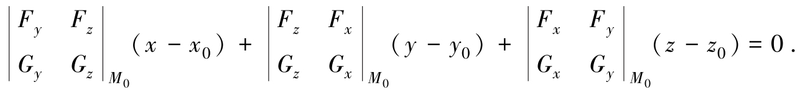

**注1** 由行列式的定义可知，借助于三阶行列式，我们可以把上述的切向量表示为

这样比较方便记忆.

**注2** 若，而中至少有一个不为零时，我们同样可得到结果.

比如，≠0（其他条件不变），则可唯一确定*x*=*x*（*z*），*y*=*y*（*z*）.

**例5** 求曲线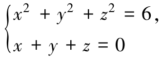在点（1，－2，1）处的切线及法平面方程.

**解法一** 设*F*（*x，y，z*）=*x*2+*y*2+*z*2－6，*G*（*x，y，z*）=*x+y+z*，则

故切向量**τ**\|（1，－2，1）=（1，0，－1），因此所求切线方程为

即

法平面方程为

1·（*x*－1）+0·（*y*+2）－1·（*z*－1）=0，

即

*x－z*=0.

**解法二**

因此可唯一确定*y*=*y*（*x*），*z*=*z*（*x*）．对方程组两端关于*x*求导，得

将点（1，－2，1）代入得

解得，因此所求切线方程为

法平面方程为

*x－z*=0.

**例6** 求曲线在点（2，－1，1）处的切线及法平面方程.

**解法一** 设*F*（*x，y，z*）=*x*2+2*y*2+*z*2－7，*G*（*x，y，z*）=2*x*+5*y*－3*z*+4，

则在点（2，－1，1）处有

*Fx*=4，*Fy*=－4，*Fz*=2；*Gx*=2，*Gy*=5，*Gz*=－3.

故切向量，因此所求切线方程为

法平面方程为

（*x*－2）+8（*y*+1）+14（*z*－1）=0，

即

*x*+8*y*+14*z*－8=0.

**解法二** 我们也可以依照推导出切向量的表达式的方法来求解，为此视方程组中*y*=*y*（*x*），*z*=*z*（*x*），对方程组两端关于*x*求导，得

解得

故有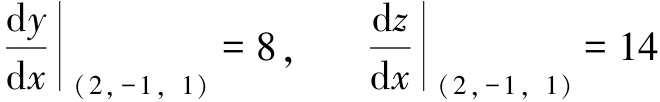，从而得到切向量**τ**\|（2，－1，1）=（1，8，14），

因此所求切线方程为

法平面方程为

（*x*－2）+8（*y*+1）+14（*z*－1）=0，

即

*x*+8*y*+14*z*－8=0.

**4. 一元向量值函数及其导数**

由空间解析几何可知，空间曲线*Γ*的参数方程为

若记**r**=（*x，y，z*），**f**（*t*）=（*φ*（*t*），*ψ*（*t*），*ω*（*t*）），则曲线*Γ*的方程可写成向量的形式：

**r**=**f**（*t*），*t*∈［*α，β*］． （2）

**定义1** 设数集*D*⊂**R**，称之为一元向量值函数，一般地，有如下定义.我们称关系**f**：*D*→**R**3为**一元向量值函数**，记为**r**=**f**（*t*），*t*∈*D*．其中数集*D*称为函数的**定义域**，*t*称为**自变量**，**r**称为**因变量**.

在**R**3中，若向量函数**f**（*t*），*t*∈*D*的三个分量函数依次为*f*1（*t*），*f*2（*t*），*f*3（*t*），*t*∈*D*，则向量值函数**f**可表示为

**f**（*t*）=*f*1（*t*）**i**+*f*2（*t*）**j**+*f*3（*t*）**k**=（*f*1（*t*），*f*2（*t*），*f*3（*t*）），*t*∈*D*.

设向量**r**的起点取在坐标系的原点，终点在*M*处，即，终点*M*的轨迹（记为曲线*Γ*）称为向量值函数**r**=**f**（*t*），*t*∈*D*的图形．而**r**=**f**（*t*），*t*∈*D*就称为曲线*Γ*的向量方程.

根据**R**3中向量的模的概念与向量的线性运算，可以定义一元向量值函数**r**=**f**（*t*）的连续性和可导性.

设向量值函数**f**（*t*）在点*t*0的某一邻域内有定义，如果，则称向量值函数**f**（*t*）在*t*0**连续**.

向量值函数**f**（*t*）在*t*0连续*f*1（*t*）、*f*2（*t*）、*f*3（*t*）在*t*0连续.

设向量值函数**f**（*t*），*t*∈*D*，若*D*1⊂*D*，**f**（*t*）在*D*1上每一点处都连续，则称**f**（*t*）在*D*1上连续，或称**f**（*t*）为*D*1上的连续函数.

设向量值函数**f**（*t*）在点*t*0的某一邻域内有定义，如果

存在，则称此极限向量为向量值函数**r**=**f**（*t*）在*t*0处的导数或导向量，记作**f**′（*t*0）或.

设向量值函数**r**=**f**（*t*），*t*∈*D*，若*D*1⊂*D*，**f**（*t*）在*D*1上每一点处都存在导向量**f**′（*t*），则称**f**（*t*）在*D*1上可导.

向量值函数**f**（*t*）在*t*0可导*f*1（*t*）、*f*2（*t*）、*f*3（*t*）在*t*0可导.

当**f**（*t*）在*t*处可导时，有

### 二、空间曲面的切平面与法线

设空间曲面*Σ*的方程为*F*（*x，y，z*）=0，其中*F*具有连续偏导数*Fx*、*Fy*、*Fz*且不同时为零．建立曲面*Σ*在点*M*0（*x*0，*y*0，*z*0）的切平面与法线方程.

在曲面*Σ*上点*M*0处可以引无数多条曲线，我们任意取其中过点*M*0的一条曲线*Γ*：

*t*∈［*α，β*］，*t*=*t*0对应的点为*M*0（*x*0，*y*0，*z*0），*φ*（*t*）、*ψ*（*t*）、*ω*（*t*）在［*α，β*］上可导，且不同时为零.

曲线*Γ*在点*M*0处的切向量为**τ**=（*φ*′（*t*0），*ψ*′（*t*0），*ω*′（*t*0）），

因为曲线*Γ*在曲面*Σ*上，所以

*F*（*φ*（*t*），*ψ*（*t*），*ω*（*t*））≡0，

由于*F*具有连续偏导数且*φ*′（*t*0）、*ψ*′（*t*0）、*ω*′（*t*0）存在，因此对上述恒等式在*t*=*t*0时有全导数=0，即*Fx*（*x*0，*y*0，*z*0）*φ*′（*t*0）+*Fy*（*x*0，*y*0，*z*0）*ψ*′（*t*0）+*Fz*（*x*0，*y*0，*z*0）*ω*′（*t*0）=0，

也可写成：

（*Fx*（*M*0），*Fy*（*M*0），*Fz*（*M*0））·（*φ*′（*t*0），*ψ*′（*t*0），*ω*′（*t*0））=0.

记 **n**\|M0=（*Fx*（*M*0），*Fy*（*M*0），*Fz*（*M*0）），则有**n·τ**\|t=t0=0，表明**n**（固定向量）与切线向量**τ**垂直．由于曲线*Γ*是*Σ*上过点*M*0的任意一条曲线，它们在点*M*0的切线都与同一向量**n**垂直，所以在曲面上通过点*M*0的一切曲线的切线都在同一平面上，这个平面称为曲面*Σ*上点*M*0处的切平面，它的法向量就是**n**（见图6-13）.

图6-13

根据平面点法式方程，可知该切平面方程为

*Fx*（*x*0，*y*0，*z*0）·（*x－x*0）+*Fy*（*x*0，*y*0，*z*0）·（*y－y*0）+*Fz*（*x*0，*y*0，*z*0）·（*z－z*0）=0，

而过点*M*0（*x*0，*y*0，*z*0）垂直于此点切平面的直线就称为曲面*Σ*上点*M*0处的法线，它的对称式（点向式）方程为

如果空间曲面*Σ*的方程为*z*=*f*（*x，y*），其中*f*具有连续偏导数，则取

*F*（*x，y，z*）=*z－f*（*x，y*）或*F*（*x，y，z*）=*f*（*x，y*）－*z*，

得曲面在点*M*0（*x*0，*y*0，*z*0）处的法线向量

**n**=（－*fx*，－*fy*，1）或**n**=（*fx*，*fy*，－1），于是点*M*0（*x*0，*y*0，*z*0）处的切平面方程为

*fx*（*x*0，*y*0）·（*x－x*0）+*fy*（*x*0，*y*0）·（*y－y*0）－（*z－z*0）=0，

法线方程为

**例7** 求曲面3*x*2+*y*2－*z*2=27在点*M*0（3，1，1）处的切平面及法线方程.

**解** 因为*F*（*x，y，z*）=3*x*2+*y*2－*z*2－27，故

*Fx*（3，1，1）=6*x*\|（3，1，1）=18，*Fy*（3，1，1）=2*y*\|（3，1，1）=2，

*Fz*（3，1，1）=－2*z*（3，1，1）=－2，

所以曲面3*x*2+*y*2－*z*2=27在点*M*0（3，1，1）处的切平面为

18（*x*－3）+2（*y*－1）－2（*z*－1）=0，

即

9*x+y－z*－27=0，

法线方程为

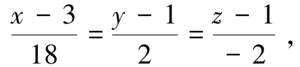

即

**例8** 求圆锥面在点*M*0（1，0，1）处的切平面及法线方程.

**解** 设，则

所以圆锥面在点*M*0（1，0，1）处的切平面为

1·（*x*－1）+0·（*y*－0）－1·（*z*－1）=0，

即

*x－z*=0；

法线方程为

即

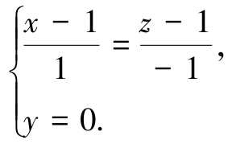

**例9** 试求曲面*x*2+*y*2+*z*2－*xy*－3=0上垂直于直线的切平面方程.

**解** 设曲面上点（*x，y，z*）处的切平面垂直于已知直线，该点处的切平面的法向量为**n**=（2*x－y*，2*y－x*，2*z*），已知直线的方向向量为，由题意知**n//s**，即，又（*x，y，z*）满足曲面方程，故可解得*x*=±1，*y*=±1，*z*=0，即切点为（－1，1，0）及（1，－1，0），所求切平面方程为

－（*x*+1）+（*y*－1）=0及－（*x*－1）+（*y*+1）=0，

即*x－y*+2=0及*x－y*－2=0.

**例10** 试证曲面（*a*\>0）上任一点处的切平面在各坐标轴上的截距之和为*a*.

**解** 任取*M*0（*x*0，*y*0，*z*0）∈*Σ*，则在该点处的切平面的法向量为

*M*0点处的切平面方程为

即

即

截距之和为

**例11** 在椭球面上求一个截取各正半坐标轴为相等线段的切平面方程.

**解** 椭球面在点*M*0（*x*0，*y*0，*z*0）处的切平面方程为

由得

因此切平面方程为

### 三、多元函数的极值

在实际问题中，我们会大量遇到求多元函数的最大值、最小值的问题．与一元函数的情形类似，多元函数的最大值、最小值与极大值、极小值有密切的联系．下面我们以二元函数为例来讨论多元函数的极值问题.

**1. 二元函数极值的概念**

**定义2** 设函数*z*=*f*（*x，y*）在点（*x*0，*y*0）的某一邻域内有定义，对于该邻域内异于（*x*0，*y*0）的任意一点（*x，y*），如果

*f*（*x，y*）\<*f*（*x*0，*y*0），

则称函数在（*x*0，*y*0）有极大值*f*（*x*0，*y*0）；如果

*f*（*x，y*）\>*f*（*x*0，*y*0），

则称函数在（*x*0，*y*0）有极小值*f*（*x*0，*y*0）；极大值、极小值统称为**极值**，使函数取得极值的点称为**极值点**.

**例12** 函数*z*=2*x*2+3*y*2在点（0，0）处有极小值．从几何上看，*z*=2*x*2+3*y*2表示一开口向上的椭圆抛物面，点（0，0，0）是它的顶点（见图6-14）.

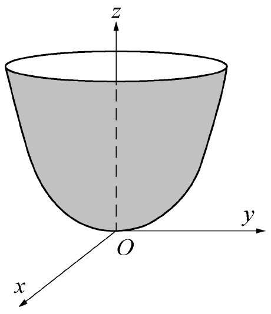

图6-14

**例13** 函数在点（0，0）处有极大值．从几何上看，表示一开口向下的半圆锥面，点（0，0，0）是它的顶点（见图6-15）.

图6-15

**例14** 函数*z*=*x*在点（0，0）处无极值．从几何上看，它表示过原点的平面（见图6-16）.

图6-16

二元函数的极值问题，一般可以用偏导数来解决．下面给出二元函数有极值的必要条件.

**定理1（必要条件）** 设函数*z*=*f*（*x，y*）在点（*x*0，*y*0）具有偏导数，且在点（*x*0，*y*0）处有极值，则它在该点的偏导数必然为零，即

*fx*（*x*0，*y*0）=0，*fy*（*x*0，*y*0）=0.

**证** 不妨设函数*z*=*f*（*x，y*）在点*P*0（*x*0，*y*0）取得极大值．由极值定义，对于点*P*0的某个邻域内异于*P*0的任意一点*P*（*x，y*），都有

*f*（*x，y*）\<*f*（*x*0，*y*0）.

特别地，取*y*=*y*0，而*x*≠*x*0，也有*f*（*x，y*0）\<*f*（*x*0，*y*0）.

这表明一元函数*f*（*x，y*0）在*x*=*x*0处取得极大值，由一元函数取得极值的必要条件可知

*fx*（*x*0，*y*0）=0.

类似地，我们可以得到

*fy*（*x*0，*y*0）=0.

与一元函数的情形类似，对于多元函数，凡是能使一阶偏导数同时为零的点称为函数的**驻点**.

从定理1可知，具有偏导数的函数的极值点必为函数的驻点．但函数的驻点不一定是极值点，例如函数*z=xy*，在点（0，0）处的两个偏导数为

所以点（0，0）是函数*z=xy*的驻点，而按定义直接可以判断出点（0，0）不是极值点.

怎样判定驻点是否为极值点呢？下面的定理给出了答案.

**定理2（充分条件）** 设函数*z*=*f*（*x，y*）在点（*x*0，*y*0）的某邻域内有直到二阶的连续偏导数，又*fx*（*x*0，*y*0）=0，*fy*（*x*0，*y*0）=0．令

*fxx*（*x*0，*y*0）=*A*，*fxy*（*x*0，*y*0）=*B*，*fyy*（*x*0，*y*0）=*C*.

（1）当*AC－B*2\>0时，函数*f*（*x，y*）在（*x*0，*y*0）处有极值，且当*A*\>0时有极小值*f*（*x*0，*y*0），*A*\<0时有极大值*f*（*x*0，*y*0）；

（2）当*AC－B*2\<0时，函数*f*（*x，y*）在（*x*0，*y*0）处没有极值；

（3）当*AC－B*2=0时，函数*f*（*x，y*）在（*x*0，*y*0）处可能有极值，也可能没有极值.

定理证明从略.

根据定理1与定理2，如果函数*f*（*x，y*）具有二阶连续偏导数，则求*z*=*f*（*x，y*）的极值的一般步骤如下.

第一步：解方程组*fx*（*x，y*）=0，*fy*（*x，y*）=0，求出*f*（*x，y*）的所有驻点.

第二步：求出函数*f*（*x，y*）的二阶偏导数，依次确定各驻点处*A*、*B*、*C*的值，并根据*AC－B*2的符号判定驻点是否为极值点．最后求出函数*f*（*x，y*）在极值点处的极值.

**例15** 求函数*f*（*x，y*）=（*x*－1）2+（*y*－4）2的极值.

**解** 先解方程组

解得驻点为（1，4）．因为

*A*=*fxx*（1，4）=2，*B*=*fxy*（1，4）=0，*C*=*fyy*（1，4）=2，

在点（1，4）处，*AC－B*2=4\>0，又*A*\>0，故函数在该点处有极小值*f*（1，4）=0.

**例16** 求函数*f*（*x，y*）=3*xy－x*3－*y*3的极值.

**解** 先解方程组

解得驻点为（0，0），（1，1）.

再求出二阶偏导数

*fxx*（*x，y*）=－6*x*，*fxy*（*x，y*）=3，*fyy*（*x，y*）=－6*y*.

在点（0，0）处，*AC－B*2=36*xy*－9\|（0，0）=－9\<0，所以，函数在该点处没有极值.

在点（1，1）处，*AC－B*2=27\>0，又*A*=-6\<0，故函数在该点处有极大值*f*（1，1）=1.

**例17** 求函数*f*（*x，y*）=*x*3－*y*3+3*x*2+3*y*2－9*x*的极值.

**解** 先解方程组

解得驻点为（1，0），（1，2），（－3，0），（－3，2）.

再求出二阶偏导数

*fxx*（*x，y*）=6*x*+6，*fxy*（*x，y*）=0，*fyy*（*x，y*）=－6*y*+6.

在点（1，0）处，*AC－B*2=12·6\>0，又*A*\>0，故函数在该点处有极小值*f*（1，0）=－5.

在点（1，2）和（－3，0）处，*AC－B*2=－12·6\<0，故函数在这两点处没有极值.

在点（－3，2）处，*AC－B*2=－12·（－6）\>0，又*A*\<0，故函数在该点处有极大值*f*（－3，2）=31.

**注** 讨论函数的极值问题时，如果函数在所讨论的区域内具有偏导数，那么由定理1可知，极值只能在驻点处取得．然而，如果函数在个别点处的偏导数不存在，这些点当然不是驻点，但可能是极值点．例如在例13中，函数在点（0，0）处的偏导数不存在，但在该点处具有极大值．因此，在考虑函数的极值问题时，除了考虑函数的驻点外，如果有偏导数不存在的点，那么对这些点也应当考虑.

**2. 二元函数的最大值与最小值**

在本章第一节已指出，如果函数*z=f*（*x，y*）在闭区域上连续，那么它在闭区域上一定有最大值和最小值．函数最大值和最小值的求法，与一元函数的解法类似，可以利用函数的极值来求．求函数*f*（*x，y*）的最大值和最小值的一般步骤如下.

（1）求函数*f*（*x，y*）在*D*内所有驻点处的函数值.

（2）求*f*（*x，y*）在*D*的边界上的最大值和最小值.

（3）将前两步得到的所有函数值进行比较，其中最大者即为最大值，最小者即为最小值.

**例18** 求函数*f*（*x，y*）=*x*2－2*xy*+2*y*在矩形域

*D*={（*x，y*）\|0≤*x*≤3，0≤*y*≤2}

上的最大值和最小值.

**解** 先求函数*f*（*x，y*）在*D*内的驻点．由*fx*=2*x*－2*y*=0，*fy*=－2*x*+2=0求得*f*在*D*内部的唯一驻点（1，1），且*f*（1，1）=1．其次求函数*f*（*x，y*）在*D*的边界上的最大值和最小值.

图6-17

如图6-17所示，区域*D*的边界包含四条直线段*L*1、*L*2、*L*3、*L*4.

在*L*1上*y*=0，*f*（*x*，0）=*x*2，0≤*x*≤3．这是*x*的单调增加函数，故在*L*1上*f*的最大值为*f*（3，0）=9，最小值为*f*（0，0）=0.

同样，在*L*2和*L*4上*f*也是单调的一元函数，易得最大值、最小值分别为

*f*（3，0）=9，*f*（3，2）=1（在*L*2上）；

*f*（0，2）=4，*f*（0，0）=0（在*L*4上）.

而在*L*3上*y*=2，*f*（*x*，2）=*x*2－4*x*+4，0≤*x*≤3，易求出*f*在*L*3上的最大值*f*（0，2）=4，最小值*f*（2，2）=0.

将*f*在驻点上的值*f*（1，1）与*L*1、*L*2、*L*3、*L*4上的最大值和最小值比较，最后得到*f*在*D*上的最大值*f*（3，0）=9，最小值*f*（0，0）=*f*（2，2）=0.

在通常遇到的实际问题中，如果根据问题的性质，可以判断出函数*f*（*x，y*）的最大值（最小值）一定在*D*的内部取得，而函数*f*（*x，y*）在*D*内只有一个驻点，则可以肯定该驻点处的函数值就是函数*f*（*x，y*）在*D*上的最大值（最小值）.

**例19** 某厂要用铁板做成一个体积为2m3的有盖长方体水箱．问当长、宽、高各取怎样的尺寸时，才能使用料最省.

**解** 设水箱的长为*x*m，宽为*y*m，则其高应为．此水箱所用材料的面积为

此为目标函数．下面求使这函数取得最小值的点（*x，y*）.

令

解这方程组，得唯一的驻点.

根据题意可断定，该驻点即为所求最小值点.

因此，当水箱的长为、宽为、高为时，水箱所用的材料最省.

**注** 体积一定的长方体中，以立方体的表面积为最小.

**3. 条件极值与拉格朗日乘数法**

前面所讨论的极值问题，对于函数的自变量一般只要求落在定义域内，并无其他限制条件，这类极值我们称为**无条件极值**．但在实际问题中，常会遇到对函数的自变量还有附加条件的极值问题．对自变量有附加条件的极值称为**条件极值**．下面介绍一种直接求条件极值的方法——**拉格朗日乘数法**.

设二元函数*f*（*x，y*）和*φ*（*x，y*）在区域*D*内有一阶连续偏导数，则求*z*=*f*（*x，y*）在*D*内满足条件*φ*（*x，y*）=0的极值问题，可以转化为求拉格朗日函数

*L*（*x，y，λ*）=*f*（*x，y*）+*λφ*（*x，y*）

（其中*λ*为某一常数）的无条件极值问题.

设点*P*0（*x*0，*y*0）是函数*z*=*f*（*x，y*）在条件*φ*（*x，y*）=0下的极值点，即函数*z*=*f*（*x，y*）在*P*0处有极值，且*φ*（*x*0，*y*0）=0，我们现在讨论取得极值的必要条件.

设函数*f*（*x，y*）和*φ*（*x，y*）在点*P*0处具有连续的偏导数，且*φy*（*x*0，*y*0）≠0，再设*y*=*g*（*x*）是由方程*φ*（*x，y*）=0所确定的隐函数，则有*y*0=*g*（*x*0）．将它代入方程*z*=*f*（*x，y*）中，得

*z*=*f*［*x，g*（*x*）］.

由点*P*0（*x*0，*y*0）是函数*z*=*f*（*x，y*）的极值点可知，点*x*=*x*0是一元函数*z*=*f*［*x，g*（*x*）］的极值点．于是，根据一元函数极值的必要条件，有

又由隐函数求导公式，知

所以，函数*z*=*f*（*x，y*）在条件*φ*（*x，y*）=0下，在*P*0（*x*0，*y*0）处有极值的必要条件为

引入比例系数（*λ*称为拉格朗日乘子），那么，上述必要条件又可写成

上式左端恰好是拉格朗日函数分别对*x、y、λ*的偏导数.

于是，求函数*z*=*f*（*x，y*）在条件*φ*（*x，y*）=0下的极值的拉格朗日乘数法的基本步骤如下.

（1）构造拉格朗日函数

*L*（*x，y，λ*）=*f*（*x，y*）+*λφ*（*x，y*），

其中*λ*为某一常数.

（2）由方程组

解出*x*、*y*，（*x，y*）就是所求条件极值的可能的极值点.

**注** 拉格朗日乘数法只给出函数取极值的必要条件，因此按照这种方法求出来的点是否为极值点，还需要加以讨论．不过在实际问题中，往往可以根据问题本身的性质来判定所求的点是不是极值点.

拉格朗日乘数法可推广到自变量多于两个而条件多于一个的情形.

**例20** 求表面积为*a*2而体积为最大的长方体的体积.

**解** 设长方体的三边长为*x、y、z*，则问题就是在条件

*φ*（*x，y，z*）=2*xy*+2*yz*+2*xz－a*2=0 （1）

下，求函数*V*=*xyz*（*x*\>0，*y*\>0，*z*\>0）的最大值.

作拉格朗日函数

解得

即

*x=y=z*.

代入式（1），得唯一可能的极值点：.

由问题本身意义知，此点就是所求最大值点．即表面积为*a*2的长方体中，以棱长为的正方体的体积为最大，最大体积.

### 习题6-4

1\. 填空题.

（1）曲线*x*=cos*t*，*y*=sin*t*，*z*=sin*t*+cos*t*在对应的点*t*=0处的切线与平面*x+By－z*=0平行，则*B*=______；

（2）曲面*z*=*x*2+*y*2在点（1，1，2）处的法线与平面*Ax+By+z*+1=0垂直，则*A*=______，*B*=______.

2\. 求下列曲线在指定点处的切线及法平面方程.

（1）*x*=*t*，*y*=*t*2，在点处；

（2）在对应点*t*=1处；

（3）在点（1，0，1）处；

（4）*x*=*t*－sin*t*，*y*=1－cos*t*，在点处；

（5）*x*=2sin2*t*，*y*=3sin*t*cos*t*，*z*=cos2*t*在对应点处；

（6）在点*M*（0，0，1）处；

（7）在点*M*（1，1，1）处；

（8）在点*M*（1，1，1）处.

3\. 求曲线与平面*x*+2*y+z*－4=0平行的切线方程.

4\. 求下列曲面在指定点处的切平面及法线方程.

（1）e*z*－*z+xy*=3，*M*（2，1，0）；

（2）*z*=*x*2+*y*2，*M*（2，1，5）；

（3）；

（4）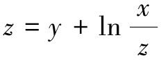，*M*0（1，1，1）.

5\. 求抛物面*z*=*x*2+*y*2的切平面，使该切平面平行于平面*x－y*+2*z*=0.

6\. 试求曲面*x*2+*y*2+*z*2－*xy*－3=0上垂直于直线的切平面方程.

7\. 求空间曲线在点（1，1，－1）处的切线方程.

8\. 求空间曲线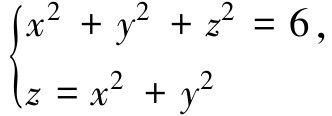在点（1，1，2）处的切线方程.

9\. 证明螺旋线*x*=*a*cos*t*，*y*=*a*sin*t*，*z=bt*上任一点处的切线都与*z*轴形成定角.

10\. 证明曲线与锥面*x*2+*y*2=*z*2的母线相交成一定角.

11\. 设函数*f*（*u，v*）具有不同时为零的一阶连续偏导数.

（1）写出曲面*Σ*：*f*（*ax－bz，ay－cz*）=0（其中*a*2+*b*2+*c*2≠0）上任一点处的切平面方程；

（2）证明该曲面上任一点的法线向量都与某确定的向量正交（垂直）并写出该向量.

12\. 证明曲面上任一点处的切平面都过原点，其中*z*具有连续导数.

13\. 证明曲面*xyz=a*3（*a*\>0）上任一点处的切平面与坐标面围成的四面体的体积为定值.

14\. 设曲面，点*M*（*x，y，z*）∈*Σ*，试证曲面*Σ*在点*M*处的法线垂直于直线*OM*（其中*O*为坐标原点）.

15\. 求下列函数的极值.

（1）*f*（*x，y*）=*x*3－4*x*2+2*xy－y*2+3；

（2）*f*（*x，y*）=3*xy－x*3－*y*3；

（3）*f*（*x，y*）=e2*x*（*x+y*2+2*y*）；

（4）*f*（*x，y*）=（6*x－x*2）（4*y－y*2）；

（5）*f*（*x，y*）=4（*x－y*）－*x*2－*y*2；

（6）；

（7）*f*（*x，y*）=e*x－y*（*x*2－2*y*2）；

（8）*f*（*x，y*）=*x*3+*y*3－3（*x*2+*y*2）.

16\. 要制造一个容积为4m3的无盖水箱，问它的长宽高应各取什么样的尺寸时，才能使所用材料最省？

17\. 求椭圆*x*2+3*y*2=12的内接等腰三角形（三角形底边平行于椭圆长轴）的最大面积.

18\. 求旋转抛物面*z*=*x*2+*y*2与平面*x+y－z*=1之间的最短距离.

19\. 在*xOy*面上求一点，使它到直线*x*=0．直线*y*=0和直线*x*+2*y*－16=0的距离的平方和最小.

20\. 把正数*a*分成三个正数之和，使它们的乘积为最大，求这三个正数.

21\. 求内接于半径为*R*的球且有最大体积的长方体.

22\. 在椭球面上求一点，使其三个坐标的乘积最大.

23\. 证明函数*z*=（1+e*y*）cos*x*－*y*e*y*有无穷多个极大值而无一极小值.

24\. 求二元函数*z=f*（*x，y*）=*x*2*y*（4－*x－y*）在直线*x+y*=6，*x*轴和*y*轴所围成的闭区域*D*上的最大值与最小值.

25\. 求函数*f*（*x，y*）=3*x*2+3*y*2－*x*3在区域*D：x*2+*y*2≤16上的最小值.

26\. 求两直线之间的最短距离.

27\. 证明不等式

其中*a、b、c*是任意的非负实数.

## 本章小结

本章小结

## 章节测试六

一、填空题.

1\. 极限=______.

2\. 函数*u*=*f*（*x，y，z*）在点（*x*0，*y*0，*z*0）沿任意方向的方向导数存在是该函数在该点可微分的______条件；函数*f*（*x，y*）在点（*x*0，*y*0）可导是在该点连续的______条件；可导函数*f*（*x，y*）在某点满足*fx*（*x，y*）=*fy*（*x，y*）=0是函数在该点取得极值的______条件.

3\. 已知函数，则*f*（*x，y*）=______.

4\. 设*z*=ln（*x－y*）+tan*t*，*x*=2*t*2，*y*=2*t*，则=______.

.

5\. *f*（*x，y*）具有二阶连续偏导数，该函数在点（*x*0，*y*0）取得极值的必要条件是______；在驻点（*x*0，*y*0）处取得极大值的充分条件是______.

6\. 曲线*x*=2*t*2，*y*=et2－1，*z*=ln*t*在*t*=1所对应点的切线方程为______；在该点的法平面方程为______.

二、计算题.

1\. 设*z*=arcsin*xy*，求.

2\. 求方程所确定的函数*z*=*z*（*x，y*）在（1，0，－1）处的偏导数.

3\. 函数*z*=*f*（*x，y*）在点（1，1）处可微，且*f*（1，1）=1，，*φ*（*x*）=*f*（*x，f*（*x，x*）），求.

4\. 函数*z*=*z*（*x，y*）由方程*xz*=sin*y+f*（*xy，z+y*）确定，其中函数*f*可微，求.

5\. 求函数*f*（*x，y，z*）=*x*3－*xy*2－cos*z*在点（1，1，0）沿**l**=（2，－3，6）方向的方向导数．说明函数在该点沿哪个方向的方向导数最大，并求出该最大的方向导数.

6\. 设*w=x+y*，其中*x*、*y*是由确定的*u、v*的函数，求.

三、求曲面平行于平面2*x*+2*y－z*=0的切平面方程.

四、求曲线*xyz*=6，*xy+yz+zx*=11于点（1，2，3）的切线方程.

五、设**n**是曲面2*x*2+3*y*2+*z*2=6在点*P*（1，1，1）处指向外侧的法向量，求函数在该点沿**n**的方向导数.

六、求*z*=*x*2+*y*2+5在约束条件*y*=1－*x*下的极值，并说明是极小值还是极大值.

七、在椭球面内作内接直角平行六面体，求其最大体积.

## 拓展阅读

**十二部数学电影**

1\. 死亡密码

英文名称：π

别名：3.14159265358

发行时间：1998年

采用科幻惊悚手法描写了一名天才数学家触目惊心的经历．才华盖世的数学家马斯在过去十年来，发现股票市场在混乱波动背后原来由一套数学模式操控，于是致力研究寻出该数学模式．没想到，主宰金融市场的一家华尔街财团，以及不择手段要破解圣经密码的一个卡巴拉宗教组织均同时派员追缉他，马斯既要保护一己安全，同时亦要尽快找出这些影响世界金融市场的密码.

2\. 美丽心灵

英文名称：A Beautiful Mind

发行时间：2001年

故事的原型是数学家小约翰·福布斯·纳什（Jr．John Forbes Nash）．英俊而又十分古怪的纳什早年就做出了惊人的数学发现，开始享有国际声誉．但纳什出众的直觉受到了精神分裂症的困扰，使他向学术上最高层次进军的辉煌历程发生了巨大改变．面对这个曾经击毁了许多人的挑战，纳什在深爱着的妻子艾丽西亚（Alicia）的相助下，毫不畏惧，顽强抗争．经过了几十年的艰难努力，他终于战胜了这个不幸，并于1994年获得诺贝尔经济学奖.

3\. 心灵捕手

英文名称：Good Will Hunting

发行时间：1997年

一个麻省理工学院的数学教授，在数学系的公布栏写下一道他觉得十分困难的题目，希望他那些杰出的学生能解开答案，可是却无人能解．结果一个年轻的清洁工却在下课打扫时，发现并轻易地解开了这道数学题.

4\. 费马大定理

英文名称：Fermat's Last Theorem

发行时间：2005年

本片从证明了费马大定理的安德鲁·怀尔斯（Andrew Wiles）开始谈起，描述了费马大定理的历史始末.

5\. 笛卡儿

英文名称：Descartes

发行时间：2006年

勒奈·笛卡儿（René Descartes，1596—1650年），法国哲学家、数学家、物理学家．他对现代数学的发展做出了重要的贡献，因将几何坐标体系公式化而被认为是解析几何之父．他还是西方现代哲学思想的奠基人，是近代唯物论的开拓者，提出了“普遍怀疑”的主张．他的哲学思想深深影响了之后的几代欧洲人，开拓了所谓“欧陆理性主义”哲学.

6\. 牛顿探索

英文名称：Newton's Dark Secrets

发行时间：2005年

1643年1月4日，在英格兰林肯郡小镇沃尔索浦的一个自耕农家庭里，牛顿诞生了．牛顿是一个早产儿，出生时只有3磅（约1.36kg）重，接生婆和他的亲人都担心他活不下来．谁也没有料到，这个看起来微不足道的小婴儿会成为一位震古烁今的科学巨人，并且竟活到了85岁的高龄.

7\. 博士热爱的算式

英文名称：Hakase No Aishita Sushiki

发行时间：2006年

一次交通意外，令天才数学博士只剩下80分钟的记忆，时间一到，所有回忆自动归零，重新开始．遇上语塞的时候，他总会以数字代替语言，以独特的风格和别人交流．他身上到处都是夹子夹着的纸条，以填补那只有80分钟的记忆．这次，新来的管家杏子带着10岁的儿子照顾博士的起居，对杏子来说，每天也是和博士的新开始．博士十分喜爱杏子的儿子，并称呼他作“根号”，因为根号能容纳所有人和事，他让母子俩认识数学算式内美丽且光辉的世界．因为只有短短80分钟，三人相处的每一刻都显得非常珍贵.

8\. 阿基米德的秘密

英文名称：Infinite Secrets：The Genius of Archimedes

发行时间：2005年

阿基米德（Archimedes，约公元前287—212年）是古希腊物理学家、数学家，静力学和流体静力学的奠基人．像伟大的牛顿和爱因斯坦一样，阿基米德也为人类的进步做出过巨大的贡献．即使牛顿和爱因斯坦也都曾从他身上汲取过智慧和灵感．他是“理论天才与实验天才合于一人的理想化身”，文艺复兴时期的达·芬奇和伽利略等人都拿他来做自己的楷模.

9\. 伽利略：为真理而战

英文名称：Galileo's Battle For The Heavens

发行时间：2006年

本片基于达娃·索贝尔（Dava Sobel）的畅销传记《伽利略的女儿：科学、信仰和爱的历史回忆》改编而成，向我们展示了伟大科学家伽利略的人生轨迹和追求真理的道路.

10\. 阿兰·图灵

英文名称：Alan Turing

发行时间：2005年

阿兰·图灵（Alan Turing）这个名字无论是在计算机领域、数学领域、人工智能领域，还是哲学、逻辑学等领域，都可谓“掷地有声”．图灵是计算机逻辑的奠基者，许多人工智能的重要方法也源自这位伟大的科学家．他在24岁时提出了图灵机理论，31岁参与了Colossus（二战时，英国破解德国通信密码的计算机）的研制，33岁时构思了仿真系统，35岁提出自动程序设计概念，38岁设计了“图灵测试”，在后来还创造了一门新学科——非线性力学．虽然图灵去世时只有42岁，但在其短暂而离奇的生涯中的那些科技成就，已让后人享用不尽．人们仰望着这位伟大的英国科学家，把“计算机之父”“人工智能之父”“破译之父”等头衔都加冕在了他身上，甚至认为，他在技术上的贡献及对未来世界的影响几乎可与牛顿、爱因斯坦等巨人比肩.

11\. 牛津杀手

英文名称：The Oxford Murders

发行时间：2008年

本片讲述远渡重洋来到牛津大学数学系深造的阿根廷留学生，刚到牛津不久即卷入一宗谋杀案．一个夏日午后，他的房东老太太在家中被杀．与他同时赶到现场的是牛津大学数理逻辑学泰斗阿瑟·塞尔登教授，因为有人在他的信箱里塞了一张纸条，上面画着一个圆圈，并写着：“序列的第一个．”接二连三的人被不露痕迹地杀害，每次案发前后，塞尔登教授周围总是出现一个奇怪的符号．种种迹象表明，凶手是在通过杀人，向塞尔登教授发起数理逻辑的挑战……一场精采的斗智由此展开.

12\. 维度：数学漫步

英文名称：Dimensions：A Walk Through Mathematics

发行时间：2008年

本片是两小时时长的科普电影，讲述了许多深奥的数学知识，如四维空间中的正多胞体、复数、分形、纤维化理论等.

-   目录
-   首页
-   设置

上下翻页

左右翻页
